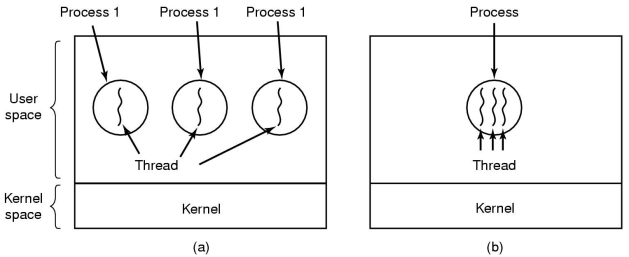
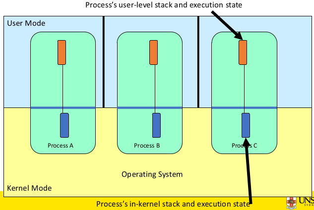
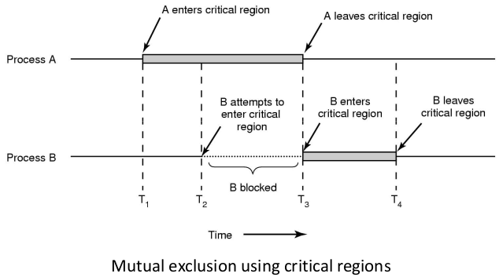
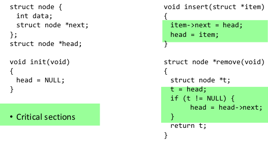
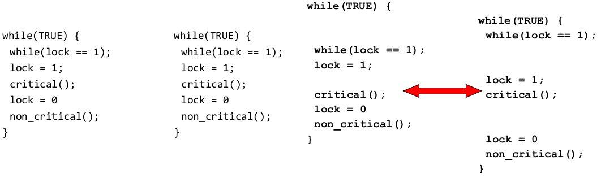
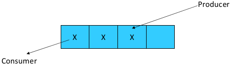

# Concurrency

Consider the following example:

`count` is a global variable that is shared between two threads implementing the functions below. After `increment()` and `decrement()` complete, what is the  value of `count`?

``` C
void increment() {
    int t;
    t =  count;
    t = t + 1;
    count = t;
}


void decrement() {
    int t;
    t =  count;
    t = t - 1;
    count = t;
}
```

We don't know. We can't make assumptions about the execution of threads relative to each other. Both threads have access to `count` and when it is accessed in an uncoordinated manner, `count` will not store its intended value.

This is known as a **race condition**.

## Where does concurrency occur?

Concurrency can occur in a multiple processes with a single thread or in a single process with multiple threads.



There is in-kernel concurrency even for single threaded processes because there are global variables and resources in the OS that can be manipulated by processes through system calls.



We can control access to shared resources by controlling access to the code that accesses the resources. Uncoordinated entry to the critical region results in a race condition, which in turn leads to incorrect behaviour, deadlock, lost work etc.

**Critical regions** or **critical sections** are regions of code that access a shared resource and their correctness relies on the shared resource not being concurrently modified by another thread/process/entity.



We've highlighted the critical regions in a basic linked list implementation below.



## Critical Regions Solutions

Our conditions required from solutions to the critical region problem:

1. **mutual exclusions** or **lock** - no two processes can simultaneously access the critical region
2. **no assumptions** can be made about speeds or numbers of CPUS
3. **progress** - no process running outside its critical region may block another process
4. **bounded** - no process waits forever to enter its critical region

### Lock ~~Solution~~

A problematic solution would be using a lock variable.  
If `lock == 1`, somebody is in the critical section and we must wait  
If `lock == 0`, nobody is in the critical section and we are free to enter

Looking at the execution sequence on the right-hand side, it is still possible for two threads to enter critical regions as the same time



### Mutual Exclusion Solutions by Taking Turns

Another proposed solution to the critical region problem is _taking turns_, where access is controlled by a `turn` variable.

``` C
// process 0
while (TRUE) {
    while (turn != 0);
    critical_region();
    turn = 1;
    noncritical_region();
}

// process 1
while (TRUE){
    while (turn != 1) {/*loop*/}
    critical_region();
    turn = 0;
    noncritical_region();
}
```

This works due to _strict alternation_ of each process taking turns.  
It does have the following **disadvantages**:

- busy waiting
- process must wait its turn while the other process is doing something else. If there are many processes, all of them must wait their turn. This does not guarantee progress and overall is a **poor solutions** when processes require the critical section for differing durations

### Mutual Exclusion Solutions by Disabling Interrupts

The solution goes like this:  
Before entering a critical region, we disable interrupts.  
After leaving the critical region, we enable interrupts.

This is a nice simple solution that works only on uniprocessor machines.  
It has the following **disadvantages**;

- only available in the kernel; it is not safe to allow applications to disable interrupts
- blocks everyone else, even with no contention; the OS will be unresponsive to interrupts from other devices which is unsafe for extended periods of time
- does not work on a multiprocessor; interrupts are per CPU

### Mutual Exclusion Solutions with Test-and-Set

There is hardware support for mutual exclusion. A **test and set** instruction can be used to implement lock variables correctly (i.e. the lock solution we suggested earlier). It works like this:

``` C
if (lock == 0) {
    set lock to 1
    return the result 0 // we acquire the lock
}

if (lock == 1) {
    return 1            // another thread/process has the lock
}
```

Hardware guarantees that the instruction executes **atomically** (that is as an indivisible unit).

```
enter region:
    TSL REGISTER,LOCK   | copy lock to register and set lock to 1
    CMP REGISTER,#0     | was lock zero?
    JNE enter_region    | if it was non-zero, lock was set, so loop
    RET                 | return to caller; critical region entered

leave_region:
    MOVE LOCK,#0        | store a 0 in lock
    RET                 | return to caller
```

This solution is simple (easy to show it's correct) and available at a user-level to any number of processors and to implement any number of lock variables.  
However because it loops to check whether it can access the critical region, it **busy waits** or **spin locks**. This consumes CPU and starvation is possible when a process leaves its critical region and more than one process is waiting.

A possible solution to the busy-wait problem is by sleeping and waking up the thread/process. The idea is that when the process is waiting for an event, it calls sleep to block instead of busy waiting. When the event happens, the even generator (another process) calls wakeup to unblock the sleeping process/thread. Waking a ready/running process has no effect.

## The Producer-Consumer Problem

In the **producer-consumer problem** or **bounder buffer problem** we have:

- a producer producing data items and storing them in a buffer
- a consumer taking out the items from the buffer and consuming them



**The issue**: we must keep an accurate count of items in the buffer

The producer should:

- sleep when the buffer is full
- wakeup when there is an empty space in the buffer; the consumer can call wakeup when it consumes the first entry of the full buffer

The consumer should:
 - sleep when the buffer is empty
 - wakeup when there are items available; the producer can call wakeup when it adds the first item to the buffer

Our first proposed solution uses a locking primitive based on a test-and-set to protect the current access.

```C
int count = 0;
#define N 4     // bufsize

prod() {                        con(){
    while (TRUE) {                  while (TRUE) {
        item = produce();               if (count == 0)
        if (count == N)                     sleep();
            sleep();                    acquire_lock();
        acquire_lock();                 remove_item();
        insert_item();                  count--;
        count++;                        release_lock();
        release_lock();                 if (count == N-1)
        if (count == 1)                     wakeup(prod);
            wakeup(con);            }
    }                           }
}
```

However this has a problematic execution sequence, where `con` may detect `count` is 0, but is then interrupted. `prod` executes all of it's steps, increasing `count` to 1, and calling `wakeup`. Since `con` is still awake nothing happens. We then resume `con` which goes to sleep. :(

Our problem here is that the test for some condition and actually going to sleep is not atomic. If we try the following:

``` C
// producer         // consumer
if (count == N)     if (count == 0)
    sleep();            sleep();
release_lock();     release_lock();

// The lock is held while asleep, so the count will never change
```

## Semaphores

Dijkstra (1965) introduced two primitives that are more powerful than a simple sleep and wakeup;

- `P()`, `wait` or `down` to test
- `V()`, `signal`, `up` to increment

If a resource is not available the corresponding semaphore blocks any process `wait`ing for the resource. Blocked processes are put into a process queue maintained by the semaphore, avoiding busy waits. When a process releases a resource, it `signal`s this by means of the semaphore. Signalling resumes a blocked process if there is any.  
Wait and signal operations cannot be interrupted.  
Complex co-ordination can be implemented by multiple semaphores.

Semaphores can be used to solve a variety of concurrency problems, however programming with them can be error-prone. E.g. you must signal for every wait if you want mutex. Too many or too few signals, or signals and waits in the wrong order can have catastrophic results.

### Semaphore Implementation

``` C
// A semaphore is defined as a record:
typdef struct {
    int count;          // #times a thread can call wait before it is blocked
    struct process *L;  // a linked list of processes blocked
                        // and waiitng for this semaphore
} semaphore;

// Semaphore operations:
wait(S) {
    S.count--;
    if (S.count < 0) {
        add process to S.L;
        sleep();
    }
}

signal(S) {
    S.count++;
    if (S.count <= 0) {
        remove process P from S.L;
        wakeup(P);
    }
}
```

Each primitive is atomic because interrupts are disabled for each.

### Semaphore Uses

#### Synchronisation Tool

Semaphores can be used a synchronisation tools.  
Say we have two threads with functions A and B, where we always want be to execute after A. Using a semaphore count intialised to 0, all we need is this:
``` C
A() {
    ...
    signal(flag);
}

B() {
    ...
    wait(flag);
}
```

When `A` runs first, `signal` is called but does nothing, then `B` runs.  
When `B` runs first, `wait` is called and `B` becomes blocked. Then `A` runs, `signal`s `B` to wake up and run.

#### Implementation of a Mutex

``` C
semaphore mutex;
mutex.count = 1     // init mutex

wait(mutex);        // enter critical region

doStuff();

signal(mutex);      // exit critical region
```

Notice how the initial count determines how many waits can progress before blocking and requiring a signal.

#### Solving the Produce-Cconsumer Problem

```C
#define N 4     // bufsize

semaphore mutex = 1;    // lock for critical regions
semaphore empty = N;    // #empty slots
semaphore full = 0;     // #full slots

prod() {                        con(){
    while (TRUE) {                  while (TRUE) {
        item = produce();               wait(full);
        wait(empty);                    wait(mutex;
        wait(mutex);                    remove_item();
        insert_item();                  signal(mutex);
        signal(mutex);                  signal(empty);
        signal(full);               }
    }                           }
}
```

## Monitors

## OS/161 Provided Synchronisation Primitives

### Locks

``` C
// Functions to create and destroy locks:
// create a lock by giving it a name (for debugging purposes)
struct lock *lock_create(const char *name);
void lock_destroy(struct lock*);

// Functions to acquire and release locks:
void lock_acquire(struct lock *);
void lock_release(struct lock *);
```

Example use of locks:
``` C
int count;
struct lock *count_lock;

int main() {
    count = 0;
    count_lock = lock_create("countlock");
    if (count_lock == NULL)
        panic("I'm dead");
    stuff();
}

procedure inc() {
    lock_acquire(count_lock);
    count = count + 1;
    lock_release(count_lock);
}

procedure dec() {
    lock_acquire(count_lock);
    count = count - 1;
    lock_release(count_lock);
}
```

If OS/161 cannot enter the critical section, it will put the thread to sleep until lock release is called, where it will allow one of the sleeping threads to enter the critical section

### Semaphores

``` C
// create a semaphore by giving it a name and an initial value
struct semaphore *sem_create(const char *name, int initial_count);
void sem_destroy(struct semaphore(struct semaphore *);

void P(struct semaphore *); // wait
void V(struct semaphore *); // signal
```

Example use of semaphores:

``` C
int count;
struct semaphore *count_mutex;

int main() {
    count = 0;
    count_mutex = sem_create("count", 1);
    if (count_mutex == NULL)
        painc("I'm dead");
    stuff();
}

procedure inc() {
    P(count_mutex);
    count = count + 1;
    V(count_mutex);
}

procedure dec() {
    P(count_mutex);
    count = count - 1;
    V(count_mutex);
}
```

### Condition Variable

You can build a monitor-like design construct by using locks and condition variables

``` C
struct cv *cv_create(const char*name);
void cv_destroy(struct cv *);

void cv_wait(struct cv *cv, struct lock *lock);
// Release the lock and blocks (puts current thread to sleep)
// Upon resumption, it re-acquires the lock.
// Note we must recheck the condition we slept on

void cv_signal(struct cv *cv, struct lock *lock);
// Wakes one thread, but does not release the lock
void cv_broadcast(struct cv *cv, struct lock *lock);
// Wakes up all threads, but does not realease the lock
// The wirst "waiter" scheduled after signaller releases the lock will acquire the lock

// Notes: all three variants must hold the lock passed in
```

Example of condition variables with bounded buffers:

``` C
// non solution
lock_acquire(c_lock);
if (count == 0)
    sleep();
remove_item();
count--;
lock_release(c_lock);

// solution
lock_acquire(c_lock);
while (count == 0)          // use while in case other threads have woken up 
    cv_wait(c_cv, c_lock);  // before you and made the count equal to 0
remove_item();
count--;
lock_release(c_lock);
```

Solving the producer consumer problem using condition variables and locks:

``` C
int count = 0;
#define N 4     // bufsize

prod() {                            con() {
    while (TRUE) {                      while (TRUE) {
        item = produce();                   lock_acquire(1);
        lock_acquire(1);                    while (count == 0)
        while (count == N)                      cv_wait(full, 1);
            cv_wait(full, 1);               item = remove_item();
        insert_item(item);                  count--;
        count++;                            cv_signal(full,1);
        cv_signal(empty,1);                 lock_release(1);
        lock_release(1);                    consume(item);
    }                                   }
}                                   }
```
