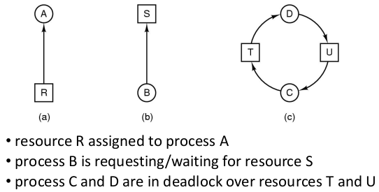
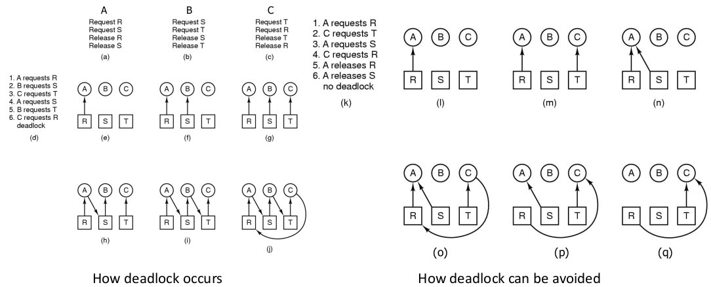
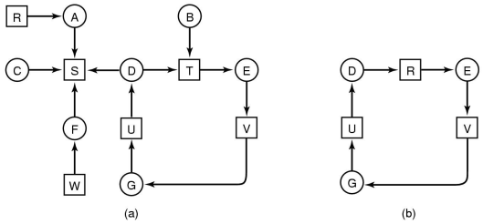
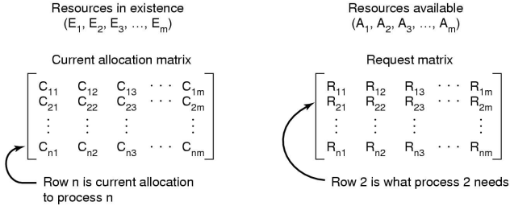
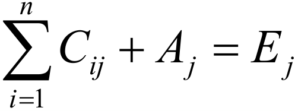
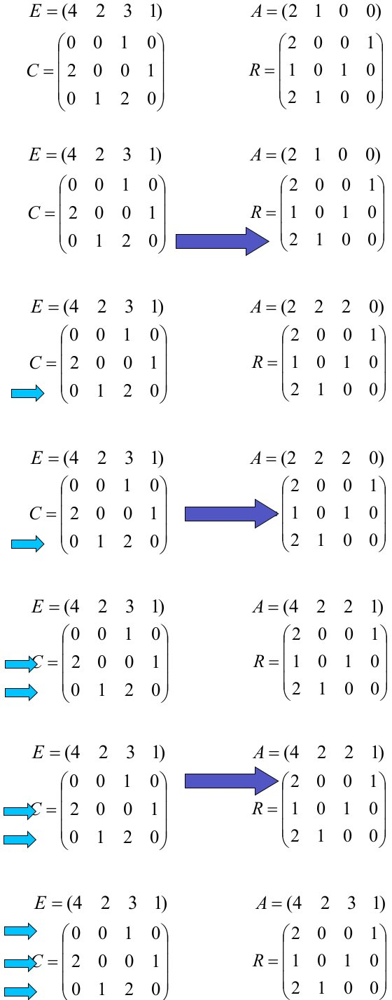
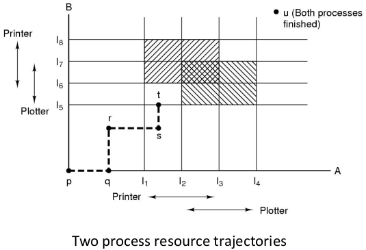
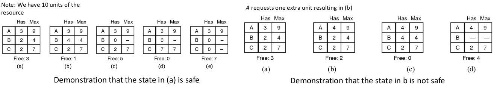
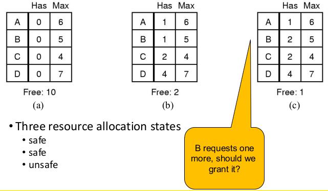

# Deadlock

Examples of computer resources include printers, tape drivers and tables in a database. Processes need access to resources in a reasonable order.  
Preemptable resources can be taken away from a process with no ill effects.  
Non-preemptable resources will cause the process to fail if taken away.

Suppose a process holds resource A and requests resource B. At the same time another process holds B and requests A. Both processes are blocked and remain so. This is known as **deadlock**.

**Deadlock** occurs when processes are granted exclusive access to devices, locks, tables etc. We refer to these entities as **resources**.

The sequence of events required to use a resource:

1. request the resource
2. use the resource
3. release the resource

If the request is denied, the process must wait. As a result the requesting process may be blocked or may fail with an error code.

We have two segments of code:

``` C
// segment 1
semaphore res_1, res_2;
void proc_A() {                     void prov_B() {
    down(&res_1);                       down(&res_1);
    down(&res_2);                       down(&res_2);
    use_both_res();                     use_both_res();
    up(&res_2);                         up(&res_2);
    up(&res_1);                         up(&res_1);
}                                   }

// segment 2
semaphore res_1, res_2;
void proc_A() {                     void prov_B() {
    down(&res_1);                       down(&res_2);
    down(&res_2);                       down(&res_1);
    use_both_res();                     use_both_res();
    up(&res_2);                         up(&res_1);
    up(&res_1);                         up(&res_2);
}                                   }
```

Segment 2 is deadlock prone because the resources are accessed in different orders;  
Say `proc_A` gains access to `res_1`, then `proc_B` runs and gains access to `res_2`. When `proc_A` tries to access `res_2` it is blocked. The same applies to `proc_B` for `res_1`. Now we are in deadlock.

Formal definition: A set of processes are **deadlocked** if each process in the set is waiting for an event that only another process in the set can cause.  
Usually the event is the release of a currently held resource. In this state, none of the processes can run, release resource or be awakened.

There are four conditions for deadlock:

1. **Mutual exclusion** condition - each resource is assigned to 1 process or is available
2. **Hold and wait** condition - processes holding resources can request additional resource
3. **No pre-emption** condition - previously granted resources cannot be forcibly taken away
4. **Circular wait** condition - there must be a circular chain of 2 or more processes. Each process is waiting for resources held by the next member of the chain

## Deadlock Modelling

We can model deadlock using directed graphs:  
circles represent processes  
squares represent resources





## Dealing with Deadlocks

Strategies for dealing with deadlocks:

1. just ignore the problem altogether
2. prevention by negating one of the four necessary conditions
3. detection and recovery
4. dynamic avoidance - careful resource allocation

### Approach 1: The Ostrich Algorithm

Pretend there is no problem. This is reasonable if deadlocks occur very rarely and the cost of prevention is high; e.g. only one process ones at a time. It is a trade-off between **convenience** (engineering approach) and **correctness** (mathematical approach)

Windows and UNIX use this approach for some of the more complex resource relationships they manage. 

### Approach 2: Deadlock Prevention

Resource allocation rules prevent deadlock by preventing one of the four conditions required for deadlock from occurring.

#### Mutual Exclusion Condition

Attacking the mutual exclusion condition is not feasible in general because some devices and resources are intrinsically not shareable.

#### Hold and Wait Condition

Attacking the hold and wait condition requires processes to request resources before starting so that a process never has to wait for what it needs. Issues with this are that 

* we may not know the required resources at the start of the process
* ties up resources other processes could be using

A variation of this could be having process give up all resources if it would block a holding resource, then request all resources immediately needed. However this is prone to **livelock**

Livelocked processes are not blocked, but they change their state regularly that they **never make progess**. e.g. Two people pass each other in a corridor that they attempt to step out of each other's way in the same direction indefinitely. Both are actively changing state, but they never pass each other.

Example of livelocked processes:

``` C
void proc_A() {                                 void prov_B() {
    lock_acquire(&res_1);                           lock_acquire(&res_2);
    while (try_lock(&res_2) == FAIL) {              while (try_lock(&res_1) == FAIL) {
        lock_release(&res_1);                           lock_release(&res_2);
        wait_fixed_time();                              wait_fixed_time();
        lock_acquire(&res_1);                           lock_acquire(&res_2);
    }                                               }
    use_both_res();                                 use_both_res();
    lock_release(&res_2);                           lock_release(&res_1);
    lock_release(&res_1);                           lock_release(&res_2);
}                                               }
```

#### No Pre-emption Condition

This is not a viable option. If a process was allocated a printer and halfway through the job, we forcibly take away the printer, the resource and job would fail.

#### Circular Wait Condition

In this, we numerically order resources so that they must be accessed in a specific order. If a resource is not available, the process will simply have to wait.


### Approach 3: Detection and Recovery

For this, we need a method to determine if a system is deadlocked. Assuming the deadlock is detected, we need a method of recovery to restore the progress of the system.

#### Detection

We can detect deadlocks with one resource of each type via our deadlock modelling. A cycle can be found within the graph denoting a deadlock.



For resources with multiple units such as RAM, blocks on a hard disk drive and slots in a buffer, we can use data structures to detect deadlocks.

We keep track of:

* resources in existence in a vector
* resources available in a vector
* resources currently allocated to process in a matrix
* resources being requested by processes in a matrix



The sum of current resources allocated and resources available should equal the amount of resources in existence



The detection algorithm works like this:

1. Look for an unmarked process _Pi_, for with the _i_-th row of R is less than or equal to A
2. If found add the _i_-th row of C to A, and mark _Pi_.  
Then go to step 1.
3. If not such processes exist, terminate.
Any remaining processes are deadlocked.

Example: the algorithm terminates with no unmarked processes so there is no deadlock



#### Recovery

We can recover from deadlock though:

* **pre-emption** - take a resource from some other process, however this depend on the nature of the resource
* **rollback** - checkpoint process states periodically. When deadlock is detected roll back to a previous state where deadlock has not occurred. There is no guarantee that deadlock won't happen again.  
This is not very practical because the operating system will be kept busy storing states. Instead this is only practical when you have long running processes (e.g. months) and roll back is necessary if data is ever lost
* **killing processes** - a simple but crude way of breaking deadlock by killing one of the process in the deadlock cycle. The other process will get its resource but the killed one will have to run from the beginning.

### Approach 4: Deadlock Avoidance

We can avoid deadlock only if we have enough information in advanced; that is we need to know the max no. of resources required.

Note: deadlock prevention and avoidance are not the same.  
Prevention the attacks conditions of deadlock while avoidance comes up with a way of allocating resources so that deadlock does not occur.

Here we have graph of two process resource trajectories, where  
the x axis represents the progress of process A  
the y-axis represents the progress of process B



If the dotted line enters where the rectangles overlap, it will be in an **unsafe state**.

A state is **safe** if:

* the system is not deadlocked
* there exists a scheduling order that results in every process running to completion, _even if they all request their maximum resources immediately_



Unsafe states are not necessarily deadlocked; with a lucky sequence, all processes may complete. However, we **cannot guarantee** that they will complete (not deadlock).  
Safe states guarantee we will eventually complete all processes.

#### Banker's Algorithm

A deadlock avoidance algorithm only grants requests that result in safe states. For this we'll use the **Banker's algorithm**.

The banker's algorithm is modelled on a banker with customers.  
The banker has a limited amount of money to loan customers (the limited no. of resources). Each customer can borrow money up to the customer's credit limit (the max. no. of resource required)

The basic idea is that we want to keep the bank in a _safe_ state so all customers are happy even if they all request to borrow up to their credit limit at the same time. Customers wishing to borrow such that the bank would enter an unsafe state must wait until somebody else repays their loan such that the transaction becomes safe.

The Banker's algorithm for a single resource:



In (b) process B requests one more resource. To determine whether we should give it or not we get (c) and see that the state is no longer safe. As a result, process B does not get its requested resource.

The Banker's algorithm for multiple resources is structured similarly to deadlock detection with multiple resources. If there aren't enough resources, the state becomes unsafe.

\#TODO for image example?

The Banker's algorithm is not commonly used in practice. It is difficult (sometimes impossible) to know in advance the resources a process will require and the number of processes in a dynamic system.

## Starvation

Starvation is when a process never receives the resource it is waiting for. Despite the resource (repeatedly) becoming free, it is always allocated to another waiting process.

E.g. An algorithm to allocate a resource may be to give the resource to the shortest job first. This works great for multiple short jobs in the system, but may cause a long job to wait indefinitely even though it is not blocked.

A solution to this would be to implement a first-come, first-serve policy.
