# Processes and Threads Implementation

## MIPS R3000

MIPS uses a load-and-store architecture. There are no instructions that operate on memory except for load and store ones.

Simple load/stores to/from memory from/to registers:

* store word: `sq r4 (r5)` stores the contents of r4 in memory using the address contained in register r5
* load word: `lw r3 (r7)` loads the contents of memory into r3 using the address contained in r7. There is a delay of one instruction after load before data is available in the destination register. There **must always** be an instruction between a load from memory and the subsequent use of the register.
* other load/store instructions: `lw sw lb sb lh sh`

Arithmetic and logical operations are register-to-register operations. There are no arithmetic operations in memory.

Examples:

``` mips
add r3, r2, r1  # r3 = r2 + r1

# other instructions
add # add
sub # subtract
and
or
xor
sll # shift left logical
srl # shift right logical
```

All instructions are encoded in 32-bit. Some instructions have _immediate_ operands. Immediate values are constants encoded in the instruction itself and are of 16-bit value. 

Examples:

``` mips
addi r2, r1, 2048   # r2 = r1 +2-48
li   r2, 1234       # r2 = 1234
```

Examples: `a = a + 1` in MIPS

``` mips
lw  r4, 32(r29)     # r29 = stack pointer, store value of a in r4
li  r5, 1
add r4, r4, r5      # r4 = r4 + 1
sw  r4, 32(r29)     # store result back into a
```

### MIPS Registers

User-mode accessible registers:

* 32 general purpose registers
  * `r0` is hardwired to `0`
  * `r31` is the **link** register for `jal` instruction, which stores the return address for when a `jal` completes
* `HI`/`LO` - `2 * 32-bits` for multiply and divide
* `PC` - the program counter. It is not directly visible and is modified implicitly by jump and branch instructions

### Branching and Jumping

Branching and jumping have **branch delay slot**. The instruction following a branch or jump is **always executed prior**  to the destination.

``` mips
    li  r2, 1       # r2 = 1
    sw  r0, (r3)    # r3 = 0
    j   1f          # execute next instruction, then jump to 1:
    li  r2, 2       # r2 = 2
    li  r2, 3       # r2 = 3

1:  sw r2, (r3)     # store value of r2 into memory address at r3, which is 2
```

This is because MIPS uses RISC architecture; a 5 stage pipeline, where instructions are partially through a pipeline prior to `jump` having an effect

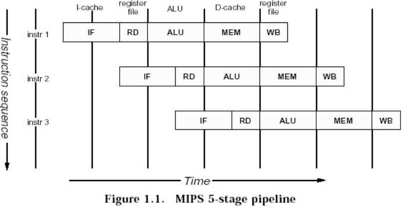

The `jal` (jump and link) instruction is used to implement function calls. When this happens `r23 = PC +8`. This is where the return address is stored when we return from the function call.

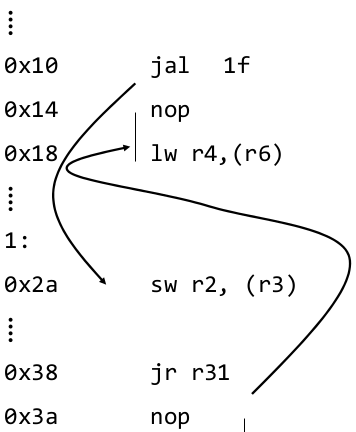

### Compiler Register Conventions

There are 32 registers in MIPS and they all have some associations:

| Reg#      | Name      | Used for                                                  |
| ---       | ---       | ---                                                       |
| `0`       | `zero`    | Always returns 0. It's value is unchangeable              |
| `1`       | `at`      | **assembly-temporary** Reserved for use by the assembler  |
| `2-3`     | `v0-v1`   | Value (except `FP`) returned by subroutine                |
| `4-7 `    | `a0-a3`   | (**arguments**) First four parameters for a subroutine    |
| `8-15`    | `t0-t7`   | (**temporaries**) subroutines may use without saving      |
| `16-23`   | `s0-s7`   | Subroutine **register variables**: a subroutine which will write in one of these must save the old value and restore it before it exits, so the _calling_ routine sees their value preserved |
| `24-25`   | `t8-t9`   | (**temporaries**) subroutines may use without saving      |
| `26-27`   | `k0-k1`   | Reserved for use by interrupt/trap handler - may change under your feet |
| `28`      | `gp`      | **global pointer** - some runtime systems maintain this to give easy access to some `static` or `extern` variables |
| `29`      | `sp`      | **stack pointer**                                         |
| `30`      | `s8/fp`   | 9th **register variable**. Subroutines which need one can use this pointer as a **frame pointer** |
| `31`      | `ra`      | Return address for subroutine                             |

Example of a factorial function in MIPS

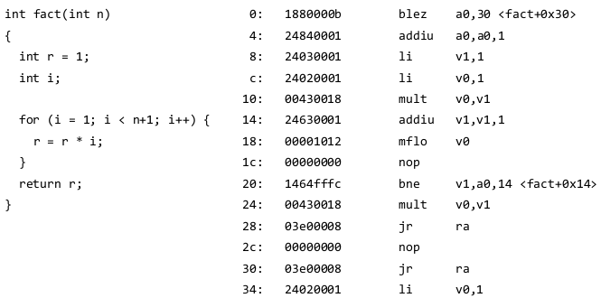

### Function Stack Frames

Each function call allocated a new stack frame for local variables, the return address, previous frame pointer etc.  
The frame pointer points to the **start** of the current stack frame  
The stack pointer points to the **end** of the current stack frame

Example: assume `f1()` calls `f2()` which calls `f3()`

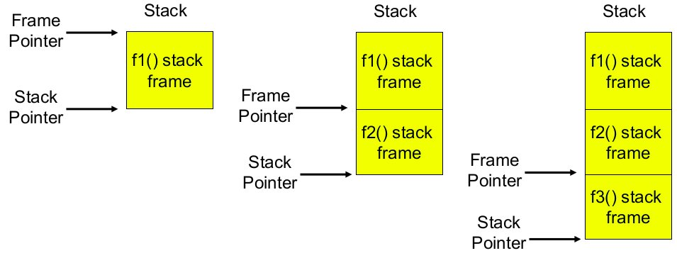

MIPS' calling convention for `gcc` has space reserved for arguments 1 to 4

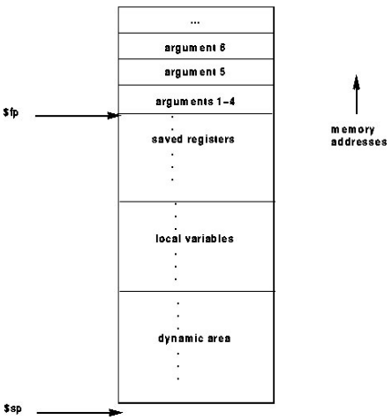

Example:

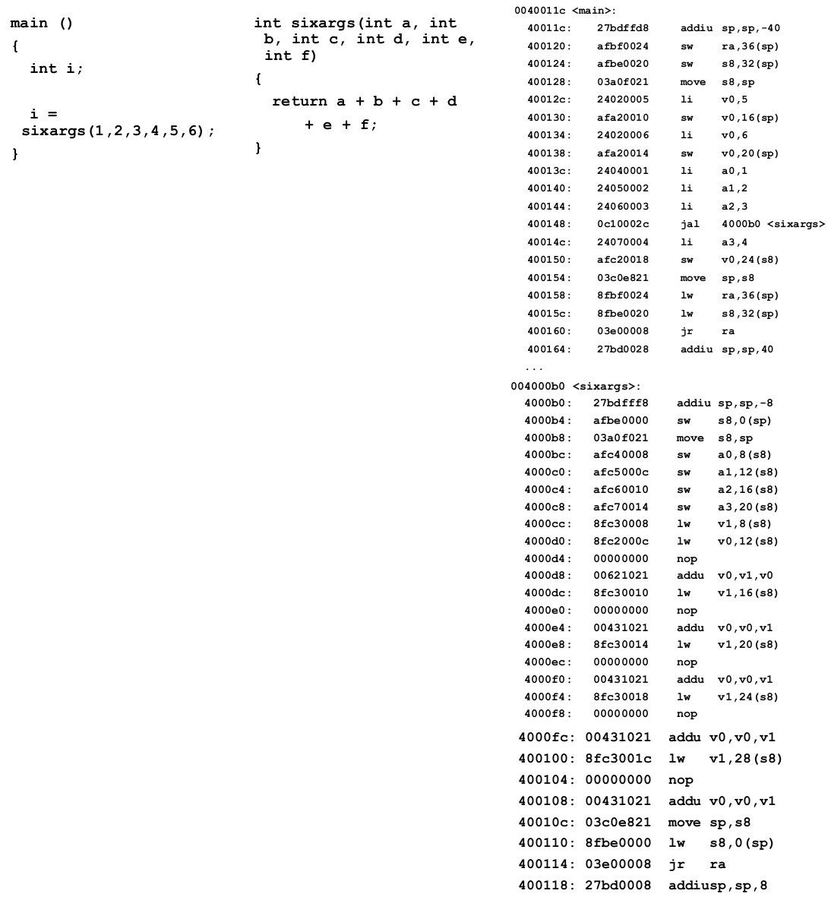

## The Process Model

Processes minimally consist of three segmnets

* **text** containing the code (instrucions)
* **data** for global variables
* **stack** for activation records of procedures/functions/methods and for local variables

Note: data can be dynamically grow up (via `malloc()`) and the stack can dynamically grow down (e.g. by increasing function call depth or recursion).

Below shows a processes stack and execution state at user and kernel levels

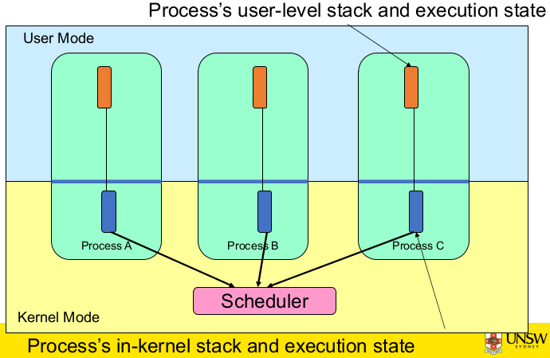

In user mode, processes (programs) are scheduled by the kernel and are isolated from each other. System calls transition into and return from the kernel  
In kernel mode, nearly all activities are still associated with a process. The kernel memory is shared between all processes and concurrency issues exist between processes concurrently executing in a system call.

## The Thread Model

)

In the thread model, we have items shared by all threads in a process and items that exist per thread.

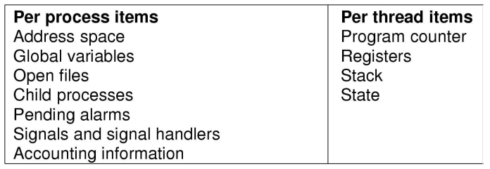

Each thread has its own stack

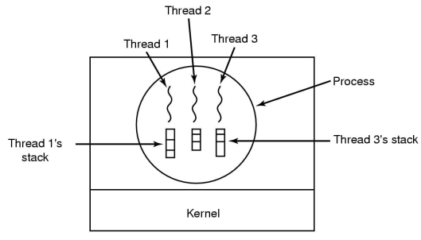

Here is a subset of POSIX threads API

``` C
int     pthread_create(pthread_t *, const pthread_attr_t *, void *(*)(void *), void *);
void    pthread_exit(void *);

int     pthread_mutex_init(pthread_mutex_t *, const pthread_mutexattr_t *);
int     pthread_mutex_destroy(pthread_mutex_t *);
int     pthread_mutex_lock(pthread_mutex_t *);
int     pthread_mutex_unlock(pthread_mutex_t *);

int     pthread_rwlock_init(pthread_rwlock_t *, const pthread_rwlockattr_t *);
int     pthread_rwlock_destory(pthread_rwlock_t *);
int     pthread_rwlock_rdlock(pthread_rwlock_t *);
int     pthread_rwlock_wrlock(pthread_rwlock_t *);
int     pthread_rwlock_unlock(pthread_rwlock_t *);
```

Independent of where we implement the threads, the application will call the library of POSIX threads

If the application calls the library to create the threads, we can implement this functionality at a user-level or kernel-level. We could create a library in the system libraries (independent of the operating system); known as **user-level threads**. The library that provides the threads doesn't make any system calls, or cross into the operating system; the operating system will not be aware of these threads. Alternatively we could call into the library and it would call thread create in the operating system. The operating system will provide the implementation 

### Implementing Threads in the User Space

A view of user-level threads:


Implementation at user level means 

* there is a User-Level Thread Control (TCB), ready queue, blocked queue, and dispatcher. * the kernel has no knowledge of the threads and it only sees a single process
* if a thread blocks waiting for a resource held by another thread inside the same process, its state is saved and the dispatcher switches to another ready thread
* thread management (create, exit, yield, wait) are implemented in a runtime support library

**Advantages**:

* thread management and switching at userlevel is much **faster** than doing it in kernel level. There is no need to trap (take syscall exceptions) into the kernel and switch back
* the dispatcher algorithm can be tuned to the application. e.g. use priorities
* can be i**implemented on any OS** (thread or non-thread aware)
* can easily **support massive numbers of threads** on a per-application basis. Use normal application memory. Kernel memory is more constrained and it difficult to efficiently support differing numbers of threads for different applications

**Disadvantages**:

* threads have to `yield` manually since there is no timer interrupt delivery to the user-level. This is known as **co-operative multithreading**. A single poorly designed/implemented thread can monopolise the available CPU time.  
There are work-around (e.g. a time signal per second to enable pre-emptive multi-threading)
* does not take advantage of multiple CPUs (in reality we still have a single threaded process as far as the kernel is concerned)
* if a thread makes a blocking system call (or takes a page fault), the process (and all the internal threads) block

### Implementing Threads in the Kernel Space

A view of kernel-level (or kernel-provided) threads:

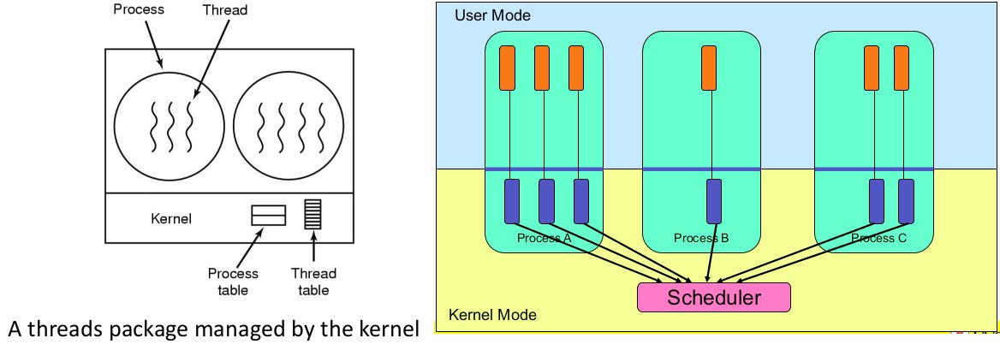

Threads are implemented by the kernel so

* TCBs are stored in the kernel. A subset of information (related to execution context) is in a traditional PCB. The TCBs have PCBs associated with them; resources associated with the group of threads (the process)
* thread management calls are implemented as system calls; e.g. create, wait,exit

**Advantages**

* **pre-emptive multi-threading**
* **parallelism** - we can overlap blocking I/O with computation and take advantage of a multiprocessor

**Disadvantages**:

* thread creation and destruction, blocking and unblocking threads requires kernel entry and exit, which is more expensive than the user-level equivalent

## Multi-programming Implementation/Context Switching

A skeleton of what the lowest level of an operating system does when an interrupt occurs; i.e a **context switch**

1. Hardware stacks program counter etc.
2. Hardware loads new program counter from interrupt vector
3. Assembly language procedure saves registers
4. Assembly language procedure sets up new stack
5. C interrupt service runs (typically read and buffers input)
6. Scheduler decides which process is to run next
7. C procedure returns to the assembly code
8. Assembly language procedure starts up new current process

A **context switch** can refer to:

* a switch between threads involving saving and restoring a state associated with a thread
* a switch between processes involving the above plus extra states associated with a process (e.g. memory maps)

A switch between process/threads can happen any time an OS is invoked on:

* a system call - mandatory if the system call blocks or is on `exit()`
* a exception - mandatory if the offender is killed
* an interrupt - triggering a dispatch is the main purpose of the _timer_ interrupt

**A thread switch can happen between any two instructions**

Note: instructions do not equal program statements; a program statement can be made of multiple instructions

Context switch must be **transparent** for processes/threads. When dispatched again, a process/thread should not notice that something else was running in the meantime (except for elapsed time); so the OS must save **all** state that affects the thread.

The state is called the **process/thread context**.  
Switching between process/threads results in a **context switch**

A diagram of a simplified explict thread switch:

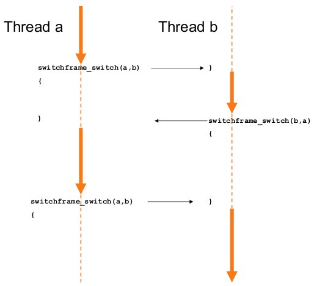

Assuming we have kernel-level threads, we will go through an example of a context switch

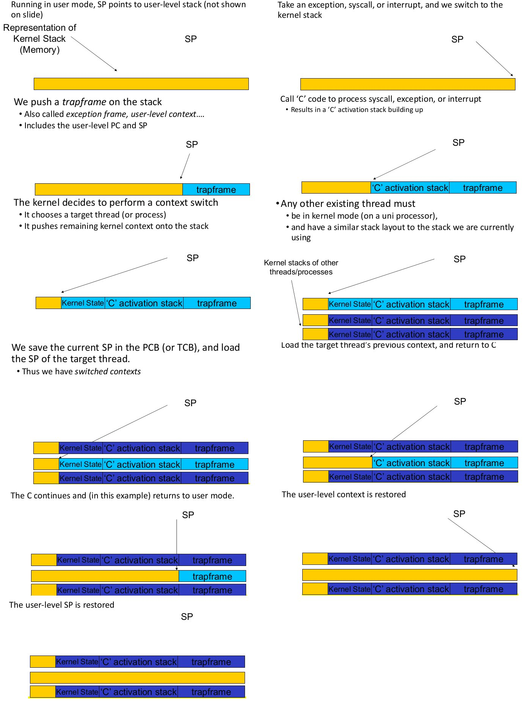

### Thread Switching in OS/161
