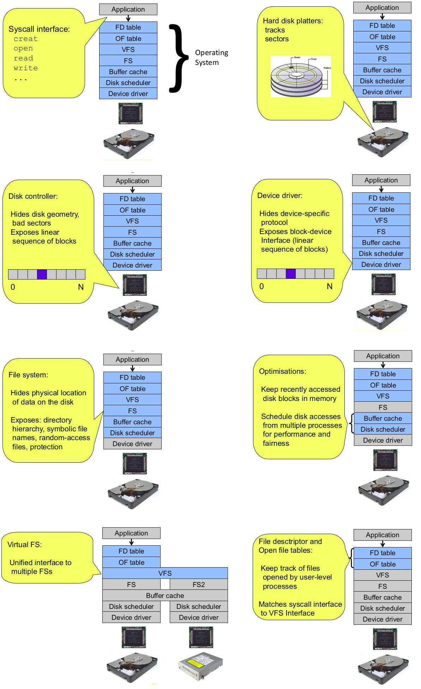
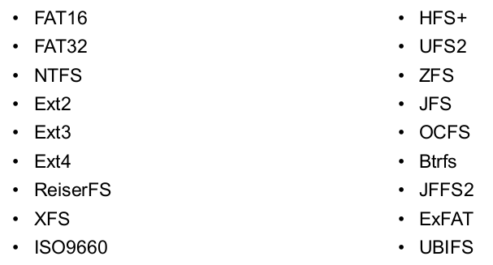
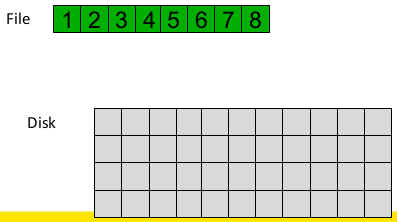
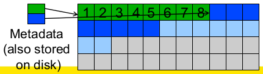
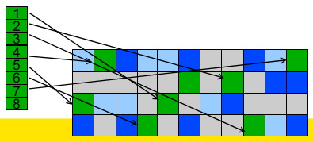

# File System Internals

UNIX storage stack:

Some popular file systems:

Why are there so many?

* Different physical nature of storage devices
  * Ext3 is optimised for magnetic disks
  * JFFS2 is optimised for flash memory devices
  * ISO9660 is optimised for CD-ROM
* Different storage capacities
  * FAT16 does not support drives >2GB
  * FAT32 becomes inefficient on drives >32GB
  * ZFS, Btrfs is designed to scale to multi-TB disk arrays
* Different CPU and memory requirements
  * FAT16 is not suitable for modern PCs but is a good fit for many embedded devices
* Proprietary standards
  * NTFS may be a nice file system, but its specification is closed

## File Systems for Magnetic Disks

We will focus on file systems for magnetic disks and will make the following assumptions:

* seek time is ~15ms in the worst case
* rotational delay is 8ms in the worst case for a 7200rpm drive

For comparison, disk-to-buffer transfer speed of a modern drive is ~10μs per 4K block.  
We can see that mechanical delays introduce significant delays relative to the actual cost of reading a block off a disk. In order to improve this we want to keep blocks that are likely to be accessed together close to each other.

### Implementing a file system

The file system must map symbolic file names into a collection of block addresses. It must keep track of 

* which blocks belong to which file
* in which order the blocks form the file
* which blocks are free for allocation

Given a logical region of a file, the file system must track the corresponding block(s) on disk. This is stored in the file system metadata.

### File Allocation Methods

A file is divided into "blocks" - the unit of transfer to storage. Given the logical blocks of a file, we need a way to decide how and where to put the blocks on a disk.

### External and Internal Fragmentation

**External fragmentation** is the space wasted **external** to the allocated memory regions. Memory space exists to satisfy a request, but it is unusable as it is not contiguous.

**Internal fragmentation** is the space wasted **internal** to the allocated memory regions. Allocated memory may be slightly larger than requested memory; this size difference is wasted memory internal to the partition.

#### Contiguous Allocation

In **contiguous allocation**, a file occupies a contiguous series of blocks on the disk.  

Advantages:

* easy bookkeeping (need to keep track of the starting block and length of the file)
* increases performance for sequential operations

Disadvantages:

* need the maximum file sixe for the file at the time of creation
* as many files are deleted, free space becomes divided into many small chunks (external fragmentation)

Examples: ISO 9660 (CDROM FS)

#### Dynamic Allocation Strategies

In **dynamic allocation** strategies, disk space is allocated in portions as needed. The allocation occurs in **fixed-sized** blocks.

Advantages:

* No external fragmentation
* does not require pre-allocating disk space

Disadvantages:

* partially filled blocks (internal fragmentation)
* file blocks are scattered across the disk
* complex metadata management (maintain the collection of blocks for each file)

##### Linked List Allocation

##### File Allocation Table

#### Inode-based File System Structure

