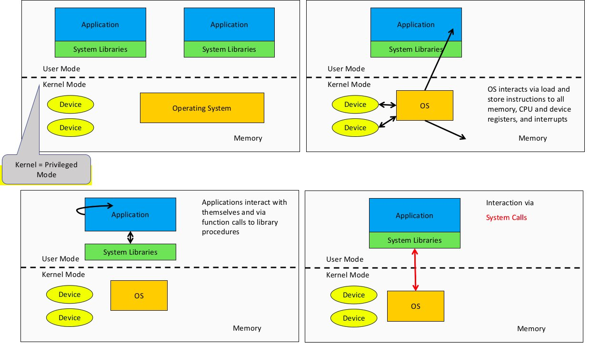
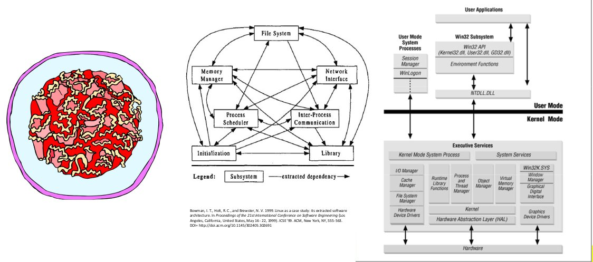

# COMP3231 - Operating Systems

## Overview

### What is an operating system?

The OS can be seen as an **abstract machine**. It extends the basic hardware with added functionality. The OS provides high level abstractions so that is is more programmer friendly and there is a common core for all applications. It hides the details of hardware and makes application code portable

The OS can also be seen as a **resource manager**. It is responsible for allocating resources to users and processes. It must ensure there is

- no starvation
- progress
- allocation according to some desired policy - e.g. first-come, first-served; fair share; weighted fair share; limits (quotas) etc.
- the system is efficiently used

A structural (implementation) view: the OS **_is_** the software _privileged_ mode

The **OS kernel** (also called **nucleus** and **supervisor**) is a portion of the operating system that is running in _privileged mode_. It usually stays in main memory and contains fundamental functionality; such as whatever is required to implement other services and to provide security. The kernel contains most-frequently used functions.

The OS is privileged. Applications should not be able to interfere or bypass the OS. The OS can enforce the "extended machine" and its resource allocation policies. This prevents applications from interfering with each other.

Delving deeper into the structure of a computer system

It is important to note that:

- the OS can interact with memory, devices, and applications
- the application can only interact with itself and system libraries; the only way it can interact with the OS is via system calls which are performed in system libraries

Some embedded OSs have **no privileged** component. e.g. PalmOS, Mac OS 9, RTEMS. They can implement OS functionality, but cannot enforce it. This means all software runs together, there is no isolation and one fault can potentially bring down the entire system.

**System libraries** are libraries of support functions (procedures, subroutines). Only a subset of library functions are actually system calls. Consider the following functions:

-  `strcmp()` and `memcpy()` are **pure library functions**. They manipulate memory within the application, or perform computation
- `open()`, `close()`, `read()`, `write()` are **system calls**. They cross the user-kernel boundary. e.g. to read from a disk device. Their implementation is mainly focused on passing requests to the OS and returning results to the application

System call functions are in the library for convenience. Try `man syscalls` on Linux for a list of system calls.

Fundamentally, OS functions the same way as ordinary computer software. It is machine code that is executed (with the same machine instructions as applications). It has more privileges (i.e. extra instructions and access). The OS relinquishes control of the processor to execute other programs, then it re-establishes control after system calls and interrupts (especially timer interrupts).

### OS Internal Structure

Most operating systems are designed as a **monolithic operating system structure** (also called the "spaghetti nest" approach). Basically everything is tangled up with everything else, however there is some reasonable structure that usually prevails.

Below are the monolithic structures of Linux and Windows

## Processes and Threads

Major requirements of an operating system include:

- interleave the execution of several processes to maximise processor utilisation while providing reasonable response time
- allocate resources to processes
- support interprocess communication and user creation of processes

**Processes**, also called a **task** or **job** are an execution of an individual program. It is the _owner_ of resources allocated to it for program execution. A process encompasses one or more threads.

**Threads** are a unit of execution. They can be traced meaning you can list the sequence of instructions that execute. Threads belong to a process and execute within the process.

### The Process Model

This is the execution snapshot of three **single-threaded** processes (with no virtual memory). The **program counter** stores the address of the instruction that is currently executing. In the case below we are currently running process B.

Here is an example of what the combined trace of processes above would look like:

Note that none of the processes finish execution in a single run. They all run for a brief moment before another process takes its place, however from the processes perspective they are running from start to finish. In this process model, only one program is active ay any instant

Process and thread models for Operating Systems

Here are some examples of Operating Systems implementing the above models

- Single process, single thread MSDOS
- Single process, multiple threads - OS/161 as distributed
- Multiple processes, single thread - Traditional UNIX
- Multiple processes, multiple threads - Modern Unix (Linux, Solaris), Windows

### Processes

#### Process Creation

Principle events that cause process creation include:

- system initialisation
    - foreground processes -interactive processes
    - background processes (also called daemon in Unix and service in Windows) - non-interactive processes such as servers (email, web, print)
- execution of a process creation system call by a running process; e.g. a new login shell for an incoming ssh connection
- user request to create a new process
- initiation of a batch job

Note: technically all these cases use the same system mechanism to create new processes

#### Process Termination

Processes terminate under the following conditions:

1. normal exit (voluntary)
2. error exit (voluntary)
3. fatal error (involuntary)
4. killed by another process (involuntary)

#### Process Implementation

A processes' information is stored in a **process control block (PCB)**. The PCBs form a **process table** which in reality is typically implemented as a dynamic data structure in a modern OS.

Example possible fields in a process table for different types of management

#### Process States

Process and threads can have the following states:

1. running
2. blocked
3. ready

The transitions between the states can be seen below:

A state may change from _running  to ready_ when the process or thread voluntarily `yield()` or they reach the end of their time slice  
A state may change from _running to blocked_ when the process or thread is waiting for input (from a file or network), waiting for a timer (alarm or signal) or waiting for a resource to become available.

The **scheduler**, also called the **dispatcher** has to choose a ready process to run. It is inefficient to search through all processes, so there is a queue.

When an _unblocking_ event occurs, we also have a queue so that we don't need to check if they are ready. In fact it is not uncommon to have queues for different types of blocking events.

### The Thread Model

We can have a thread model where each process has a single thread or a model where a single process can have multiple threads.

Here is a list of items we would need to track when separating execution from the environment

A **single-threaded model** would require each step to be executed in order, which results in blocked operations and delays for all other steps that can be run independently

a single thread keeps track of what it is doing locally without worrying about what is happening outside it. Helps with scalability

There is an alternaitve which is Finite-State Machine Model (or **Event-based Model**, which still give throughput

Thread models do not have "explicit book-keeping" of its events

| Model                     | Characteristics                                       |
| ---                       | ---                                                   |
| Single-threaded process   | No parallelism, blocking system calls                 |
| Threads                   | Parallelism, blocking system calls                    |
| Finite-state machines     | Parallelism, non-blocking system calls, interrupts    |

## Concurrency and Deadlock

## File Systems

## Scheduling

## I/O

## Multiprocessors

## Memory and Virtual Memory Management

