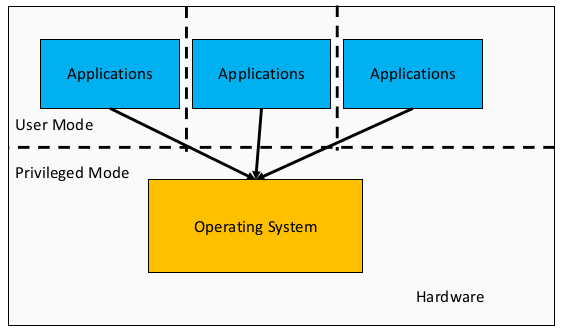

# COMP3231 - Operating Systems

## Overview

### What is an operating system?

The OS can be seen as an **abstract machine**. It extends the basic hardware with added functionality. The OS provides high level abstractions so that is is more programmer friendly and there is a common core for all applications. It hides the details of hardware and makes application code portable

The OS can also be seen as a **resource manager**. It is responsible for allocating resources to users and processes. It must ensure there is 
- no starvations
- progress
- allocation according to some desired policy - e.g. first-come, first-served; fair share; weighted fair share; limits (quotas) etc.
- the system is efficiently used

A structural (implementation) view: the OS **_is_** the software _privileged_ mode

The **OS kernel** (also called **nucleus** and **supervisor**) is a portion of the operating system that is running in _privileged mode_. It usually stays in main memory and contains fundamental functionality; such as whatever is required to implement other services and to provide security. The kernel contains most-frequently used functions.

## Processes and Threads

## Concurrency and Deadlock

## File Systems

## Scheduling

## I/O

## Multiprocessors

## Memory and Virtual Memory Management

