# Processes and Threads

Major requirements of an operating system include:

* interleave the execution of several processes to maximise processor utilisation while providing reasonable response time
* allocate resources to processes
* support interprocess communication and user creation of processes

**Processes**, also called a **task** or **job** are an execution of an individual program. It is the _owner_ of resources allocated to it for program execution. A process encompasses one or more threads.

**Threads** are a unit of execution. They can be traced meaning you can list the sequence of instructions that execute. Threads belong to a process and execute within the process.

## The Process Model

This is the execution snapshot of three **single-threaded** processes (with no virtual memory). The **program counter** stores the address of the instruction that is currently executing. In the case below we are currently running process B.

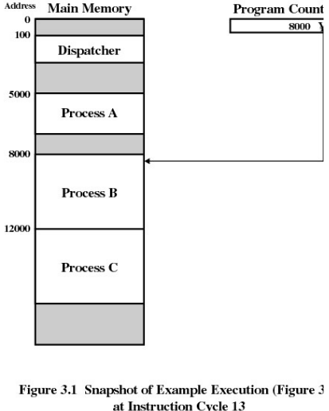

Here is an example of what the combined trace of processes above would look like:

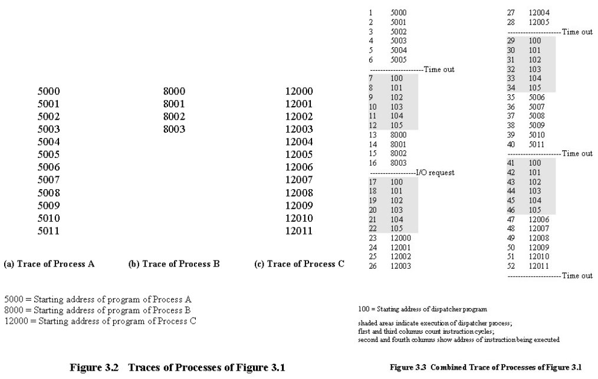

Note that none of the processes finish execution in a single run. They all run for a brief moment before another process takes its place, however from the processes perspective they are running from start to finish. In this process model, only one program is active at any instant

Process and thread models for Operating Systems

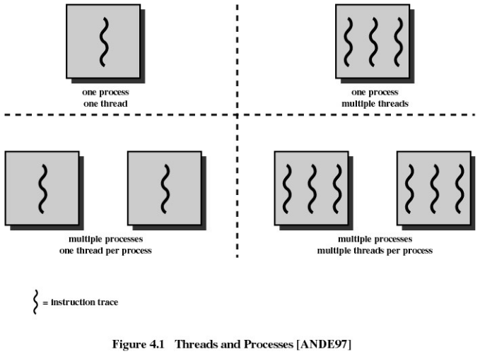

Here are some examples of Operating Systems implementing the above models

* Single process, single thread MS-DOS
* Single process, multiple threads - OS/161 as distributed
* Multiple processes, single thread - Traditional UNIX
* Multiple processes, multiple threads - Modern Unix (Linux, Solaris), Windows

## Processes

### Process Creation

Principle events that cause process creation include:

* system initialisation
    * foreground processes -interactive processes
    * background processes (also called daemon in Unix and service in Windows) - non-interactive processes such as servers (email, web, print)
* execution of a process creation system call by a running process; e.g. a new login shell for an incoming ssh connection
* user request to create a new process
* initiation of a batch job

Note: technically all these cases use the same system mechanism to create new processes

### Process Termination

Processes terminate under the following conditions:

1. normal exit (voluntary)
2. error exit (voluntary)
3. fatal error (involuntary)
4. killed by another process (involuntary)

### Process Implementation

A processes' information is stored in a **process control block (PCB)**. The PCBs form a **process table** which in reality is typically implemented as a dynamic data structure in a modern OS.

Example possible fields in a process table for different types of management

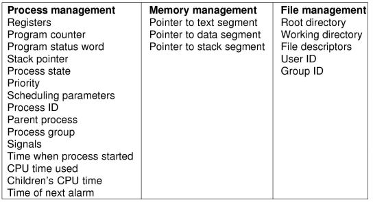

### Process States

Process and threads can have the following states:

1. running
2. blocked
3. ready

The transitions between the states can be seen below:

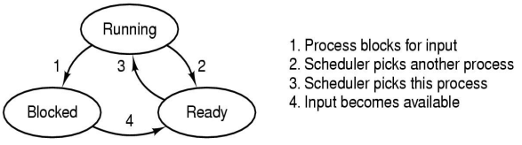

A state may change from _running  to ready_ when the process or thread voluntarily `yield()` or they reach the end of their time slice  
A state may change from _running to blocked_ when the process or thread is waiting for input (from a file or network), waiting for a timer (alarm or signal) or waiting for a resource to become available.

The **scheduler**, also called the **dispatcher** has to choose a ready process to run. It is inefficient to search through all processes, so there is a queue.

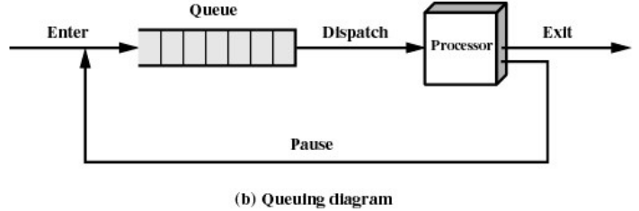

When an _unblocking_ event occurs, we also have a queue so that we don't need to check if they are ready. In fact it is not uncommon to have queues for different types of blocking events.

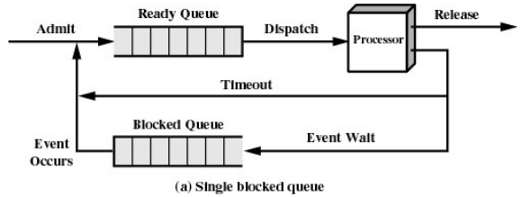

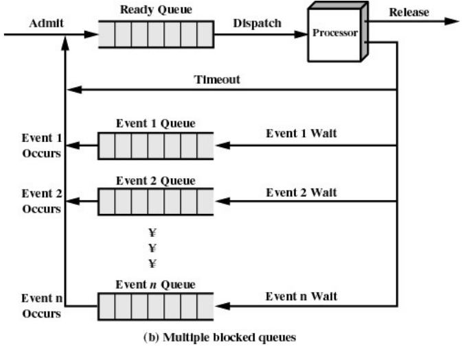

## The Thread Model

We can have a thread model where each process has a single thread or a model where a single process can have multiple threads.

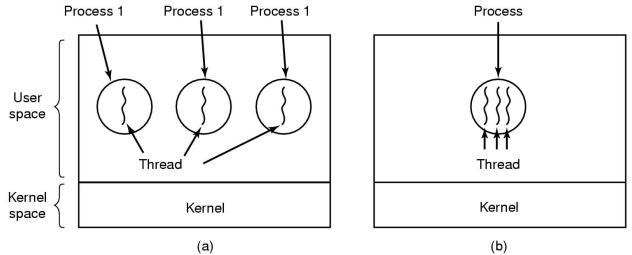

Here is a list of items we would need to track when separating execution from the environment

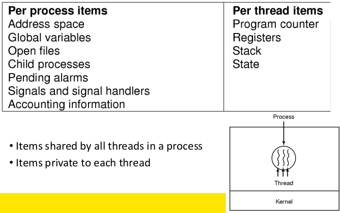

Using an analogy to a Hamburger restaurant, we can visually represent the different types of thread models we can have:

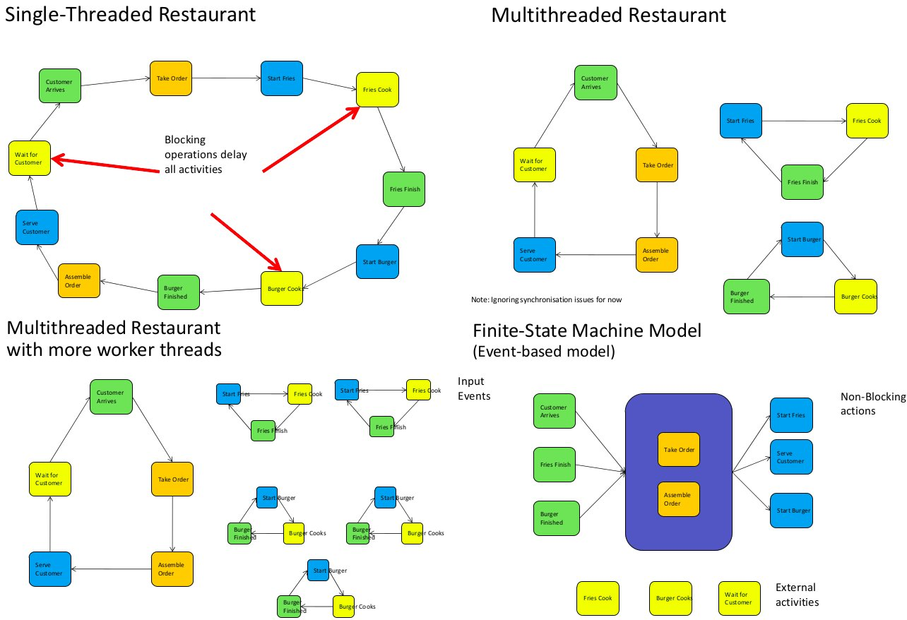

| Model                     | Characteristics                                       |
| ---                       | ---                                                   |
| Single-threaded process   | No parallelism, blocking system calls                 |
| Multi-threaded process    | Parallelism, blocking system calls                    |
| Finite-state machines     | Parallelism, non-blocking system calls, interrupts    |

We define

* a event or request to be **blocking** when other actions **cannot** be performed while we wait for the result. This means we always get a result, but we will have to wait for it
* a event or request to be **non-blocking** when other actions **can** be performed while we wait for a result. The request will return immediately without the result but we are able to continue execution of other actions. When the result is ready, the program will be _notified_ and can return to completing actions related to the request originally made

In the thread model, each thread has its own stack.

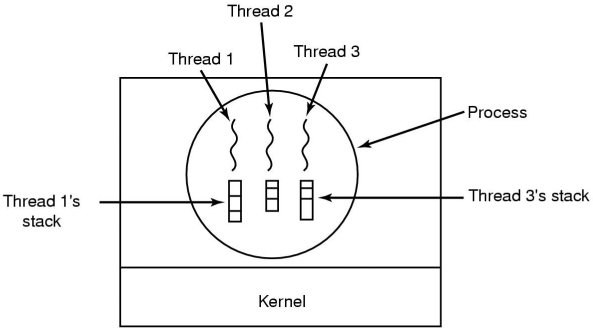

Local variables are **per thread** and they are allocated on the stack.  
Global variables are **shared between all threads** and are allocated in the data section. Uncoordinated access to global variables can "corrupt" the intended value in the variable resulting in concurrency control issues.  
Dynamically allocated memory can be **global or local** depending on the pointer pointing to the memory; global pointers means the memory is global, local pointers means memory is local

### Multi-thread Model vs. Finite State (Event) Model

Both models allow parallelism. However, in the thread model, the program state is stored implicitly in the stack. All threads execute are aware only of their own state and do not care about what is happing outside of it. In the Event model, the state is explicitly managed by the program, meaning it has some book-keeping on event happening in the program.

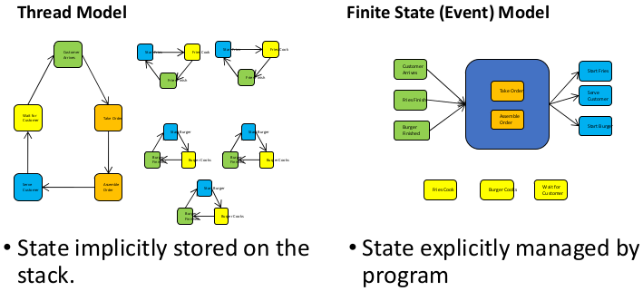

Why threads?

We use threads because:

* they are **simpler** to program than a state machine
* **less resources** are associated with them than a complete process; it is cheap to create and destroy and they share resources (especially memory) between each other
* **performance** - threads waiting for I/O can be overlapped with computing threads. Note that if all threads are _compute bound_, then there is no performance improvement (on a uniprocessor)
* take advantage of **parallelism** available on machines with more than one CPU (multiprocessor)

### Thread Usage

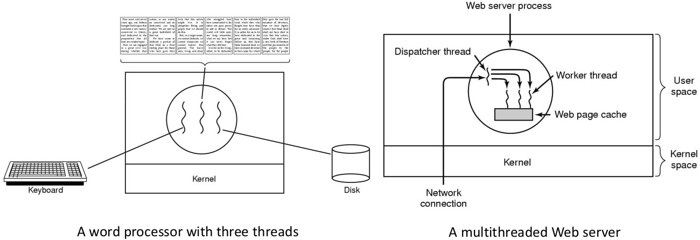

Here is a rough outline of code for the multi-threaded web server

``` C
// dispatcher thread
while (TRUE) {
    get_next_request(&buf);
    handoff_work(&buf);
}


// worker thread - can overlap disk I/O with execution of other threads
while (TRUE) {
    wait_for_work(&buf);
    look_for_page_in_cache(&buf, &page);
    if (page_not_in_cache(&page))
        read_page_from_disk(&buf, &page);
    return_page(&page);
}
```
