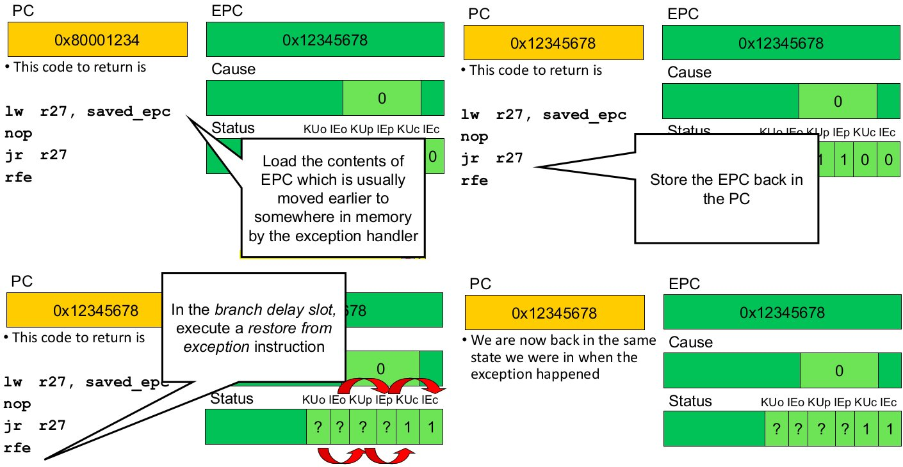
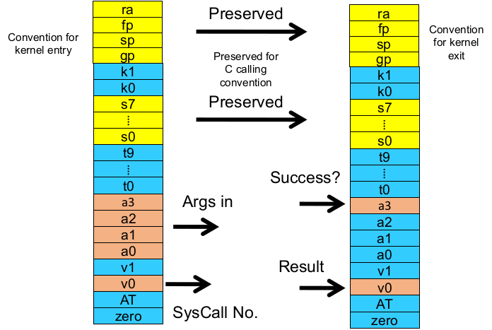
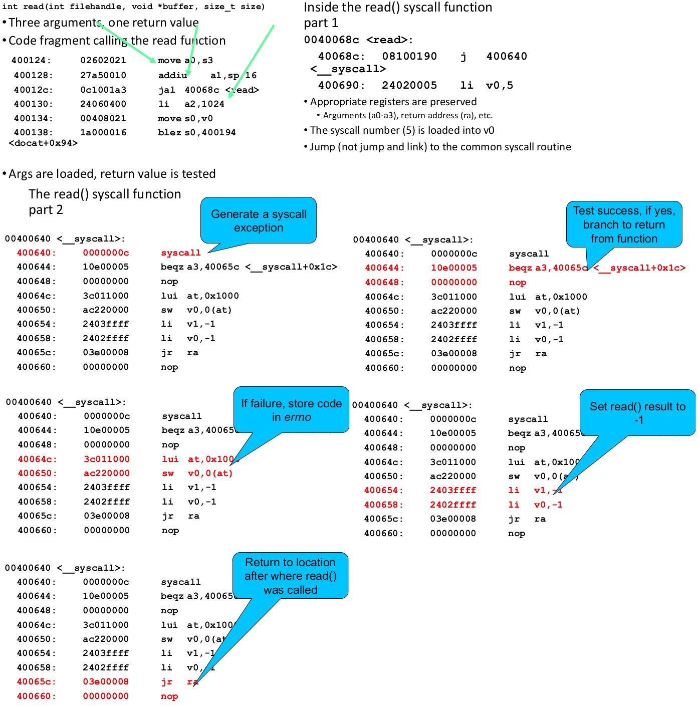
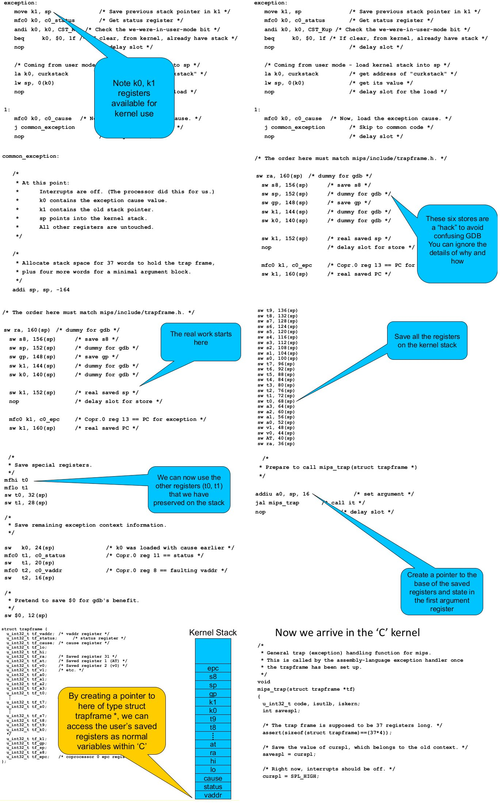
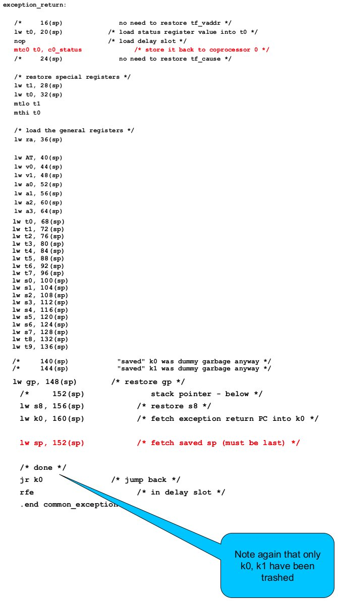

# System Calls


**System calls** can be viewed as special function calls that provide a controlled entry into the kernel. While in the kernel, they perform a privileged operation and return to the original caller with the result. They restrict possible entry points to secure locations to prevent entering after any security checks.  
The system call interface represents the abstract machine provided by the operating system.

A brief overview of the system call interface from the user's perspective:

* process management
* file I/O
* directories management
* some other selected calls
* many more; see `man syscalls` for a list

Some system calls for process management

| Call                                      | Description                                       |
| ---                                       | ---                                               |
| `pid = fork()`                            | create a child process identical to the parent    |
| `pid = waitpid(pid, &statloc, options)`   | wait for a child process to terminate             |
| `s = execve(name, argv, environp)`        | replace a process' core image                     |
| `exit(status)`                            | terminate process execution and return status     |

Some system calls for file management

| Call                                      | Description                              |
| ---                                       | ---                                      |
| `fd = open(file, how, ...)`               | open a file for reading, writing or both |
| `s = close(fd)`                           | close an open file                       |
| `n = read(fd, buffer, nbytes)`            | read data from a file into a buffer      |
| `n = write(fd, buffer, nbytes)`           | write data from a buffer into a file     |
| `position = lseek(fd, offset, whence)`    | move the file pointer                    |
| `s = stat(name, &buf)`                    | get a file's status information          |

A stripped down shell is essentially:

``` C
while (TRUE) {                              // repeat forever
    type_prompt();                          // display prompt
    read_command(command, parameters)       // input from terminal

    if (fork() != 0) {                      // fork off child process
        /* Parent code */
        wait(-1, &status, 0);               // wait for child to exit
    } else {
        /* Child code */
        execve(command, parameters, 0);     // execute command
    }
}
```

Some Win32 API calls and their equivalent UNIX syscalls:


## System Call Implementation

A simple model of CPU computation uses the **fetch-execute cycle**.

1. load memory contents from address in program counter (PC)
2. execute instruction
3. increment PC
4. repeat


There is/are also

* stack pointer (SP)
* status register for condition codes
    * positive result
    * zero result
    * negative result
* general purpose registers, which hold operands of most instructions and enables programmers (compilers) to minimise memory references

In privileged-mode operation, to protect the operating system execution, two or more CPU modes of operation exist;  
**Privileged mode** (or **system/kernel-mode**), where all instructions and registers are available  
**User-mode**, which uses and can only access 'safe' subset of the instruction set. It only affects the state of the application itself and cannot be used to uncontrollable interfere with the OS


An example of an _unsafe_ instruction would be the `cli` instruction on the x86 architecture, which disables interrupts. An example exploit:

``` assembly
cli /* disable interupts */
while (true)
    /* loop forever */
```

The accessibility of addresses within an address space changes depending on the operating mode (to protect kernel code and data). Note that the exact memory ranges are usually configurable and vary between CPU architectures and/or operating systems


### System Call Mechanism Overview

When a system call is made the syscall mechanism securely transfers from user execution to kernel execution and back.


System call transitions are triggered by special processor instructions.  
From user to kernel via a system call instruction  
from kernel to user via a return from a privileged mode instruction

During a system call:

* the processor mode
    * switched from user-mode to kernel-mode
    * switched back when returning to user-mode
* the stack pointer (SP)
    * user-level SP is saved and kernel SP is initialised
    * user-level SP is restored when returning to user-mode
* the program counter (PC)
    * user-level PC is saved and PC is set to kernel entry point
    * user-level PC is restored when returning to user-level
    * kernel entry via designated entry point must be strictly enforced
* registers
    * set at user-level to indicate the system call type and its arguments; this is a convention between applications and the kernel
    * some registers are preserved at user-level or kernel level in order to restart user-level execution; this depends on the language calling convention etc.
    * result of the system call is placed in registers when returning to user-level; another convention

Steps in making a system call:


### MIPS R2000/R3000

Before we look at system call mechanisms in detail, we'll need a basic understanding of MIPS R3000

The processor control registers are located in CP0. It contains exception/interrupt management registers, translation management registers etc. CP0 is manipulated using `mtc0` (move to and `mfc0` (move from) instructions; these instructions are only accessible in kernel mode

CP0 Registers:

* Exception Management
    * `c0_cause` **stores the cause of the recent exception**
    * `c0_status` **stores the current status of the CPU**
    * `c0_epc` **stores the address of the instruction that caused the exception**
    * `c0_baddvaddr` stores the address accessed that caused the exception
* Miscellaneous
    * `c0_prid` stores the process identifier
* Memory Management
    * `c0_index`
    * `c0_random`
    * `c0_entryhi`
    * `c0_entrylo`
    * `c0_context`

For now we will only focus on the registers in **bold**. We will look at the other ones later


### Hardware Exception Handling


For now we will ignore how the exception is actually handled and how user-level registers are preserved. We will simply look at how we return from the exception.



## MIPS System Calls

In MIPS, system calls are invoked via a `syscall` instruction. The instruction causes an exception and transfers control to the general exception handler. A convention (an agreement between the kernel and application) is required as to how user-level software indicated:

* which system call is required
* where its arguments are
* where the results should go

## OS/161 System Calls

OS/161 uses the following conventions:

* arguments are passed and returned via the normal C function calling convention
* register `v0` contains the system call number;
if successful, register `a3` contains `0` on return
if unsuccessful, `v0` has the error number, which is stored in `errno` and `-1` is returned in `v0`



Here is a walk through of a user-level system call, calling `read()`



From the caller's perspective, the `read()` system call behaves like a normal function. It preserves the calling convention of the language. However the actual function implements its own convention by agreement with the kernel. Our OS/161 example assumes the kernel preserves appropriate registers (`s0-s8`, `sp`, `gp` `ra`). Most languages has similar _libraries_ that interface with the operating system.

On the kernel side of the system call:

* we change to the kernel stack
* preserve registers by saving them into memory (on the kernel stack)
* leave saved registers somewhere accessible to read arguments and store return values
* do the `read()`
* restore registers
* switch back to the user stack
* return to the operation

## OS/161 Exception Handling

Note: the following code is from the uniprocessor variant of 0S161 (v1.x). It is simpler but broadly similar to the current version



After this, the kernel deals with whatever causes the exception; a syscall, interrupt, page fault etc. and potentially modifies the _trapframe_. `mips_trap` eventually returns


