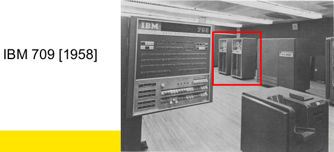
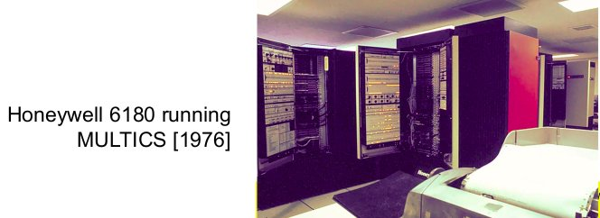
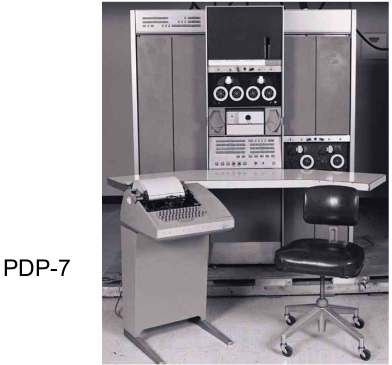
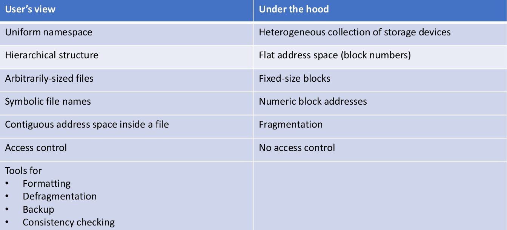
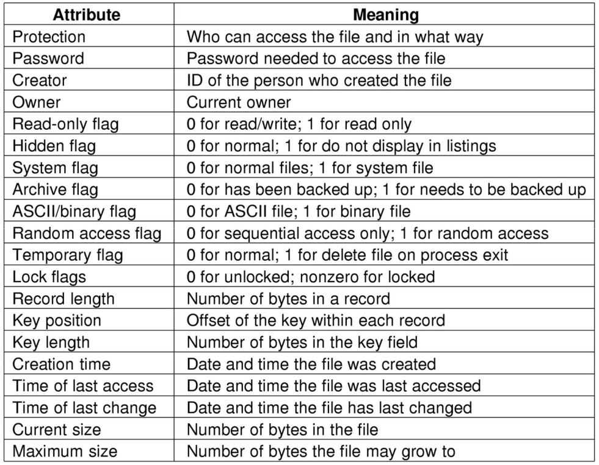
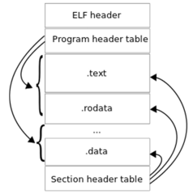
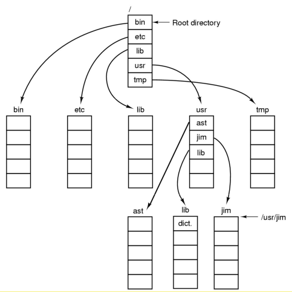

# File Management

## History

A brief history of file systems:

Early batch processing systems had no OS, I/O from/to punch cards, tapes and drums for external storage, but not file system. There was rudimentary library support for reading/writing tapes and drums.



The first file systems were single-level (everything in one directory). Files were stored in contiguous chunks, where the maximal file size must be known in advance. Now you can edit a program and save it in a named file on the tape.


Time-sharing operating systems required full-fledged file systems. MULTICS used a multi-level directory structure, keeping file that belong to different users separately. It had acces control lists and symbolic links.



UNIX was based on ideas from MULTIX with a simple access control model; everything is a file.



## Overview of File System Abstraction



### Files

File systems must provide a convenient naming scheme:

* textual names
* may have restrictions; can only have certain characters e.g. no `/` characters; limited length; only certain format e.g. DOS, 8+2
* case (in)sensitive
* names may obey conventions (`.c` for C files); interpreted by tools (e.g. UNIX); interpreted by operating system (e.g. Windows "con:")

Files are structured as a sequence of bytes. The OS considers a file to be unstructured. Applications can impose their own structure, however a sequence of bytes is used by UNIX, Windows and most modern OSs.

A list of some file types:

* regular files
* directories
* device files; may be divided into character devices (stream of bytes) or block devices

Some systems distinguish between regular file types; ASCII text files, binary files

Files can have **sequential acces** where we can read all bytes/records from the beginningbut cannot jump around, but can rewind or back up. This is convenient when the medium is magnetic tape.

There is also **random access** where bytes/records can be read in any order. This is essential for database systems. We can read the file by moving a file pointer then calling read (`lseek(location,...); read();`) or specifying where to read (`read(location,...)`

File attributes:



Typical file operations include:

* create
* delete
* open
* close
* read
* write
* append
* seek
* get attributes
* set attributes
* rename

Example: a program using file system calls:

``` C
/* File copy program. Error checking and reporting is minimal */

#include <sys/types.h>
#include <fcntl.h>
#include <stdlib.h>
#include <unistd.h>

int main(int argc, char *argv[]);

#define BUF_SIZE 4096
#define OUTPUT_MODE 0700

int main(int argc, char *argv[])
{
    int in_fd,, out_fd, rd_count, wt_count;
    char buffer[BUF_SIZE];

    if (argc != 3) exit(1);

    /* Open the input file and create the output file */
    in_fd = open(argv[1], O_RDONLY);
    if (in_fd < 0) exit(2);
    out_fd = open(argv[2], OUTPUT_MODE);
    if (out_fd < 0) exit(3);

    /* Copy loop */
    while (TRUE) {
        rd_count = read(in_fd, buffer, BUF_SIZE);
        if (rd_count <= 0) break;
        wt_count = write(out_fd, buffer, BUF_SIZE);
        it (wt_count <= 0) exit(4);
    }

    /* Close the files */
    close(in_fd);
    close(out_fd);
    if (rd_count == 0)
        exit(0);            /* no error on last read */
    else
        exit(5);            /* error on last read */
}
```

### File Organisation/Layout

Given an operating system supporting unstructured files that are a stream of bytes, how can we organise the contents of the file?  
One such format is the Executable Linkable Format (ELF)



Some possible access patterns:

* read the whole file
* read individual records from the file, where a record is a sequence of bytes containing the record
* read records preceding or following the current one
* retrieve a set of records
* write a whole file sequentially
* insert/delete/update records in a file

Programmers are free to structure the file to suit the application

Things to consider when designing a file layout:

* rapid access; this is needed when accessing a single record, but not needed for batch mode
* ease of update; a file on a CD-ROM will not be updated, so this is not a concern
* economy of storage; should be minimum redundancy in data; redundancy can be used to speed access such as an index

### File Directories

File directories provide a mapping between file names and the files themselves. They contain information about file attributes, location, ownership etc. The directory itself is a file owned by the operating system.



Files can be located by following a path from the root, or master directory down various branches. This is the **absolute pathname** for a file. There can be several files with the same file name as long as they have unique path names.

Always specifying the absolute pathname for a file can be tedious, so we have a **current working directory**; the directory you are currently in. File can then be referenced relative to the working directory.

An **absolute pathname** is a path specified from the root of the file system to the file.  
A **relative pathname** is a path specified from the current working directory  
E.g given `cwd=/home/kevine`, the following files are all the same`../..etc/passwd`, `/etc/passwd`, `../kevine/../.././etc/passwd`

Note: `.` and `..` refer to the current and parent directory respectively

Typical directory operations include:

* create
* delete
* opendir
* closedir
* readdir
* rename
* link
* unlink

### Naming Conventions

Some nice properties of UNIX naming is that it:

* has a simple, regular format - names referring to different servers, objects etc. have the same syntax. Regular tools can be used where specialised tools would be otherwise needed
* is location dependent - objects can be distributed or migrated, and continue with the same names.

An example of a bad naming convention is `UCBVAX::SYS$DISK:[ROB.BIN]CAT_V.EXE;13` from Rob Pike and Peter Weinberger, "The Hideous Name", Bell Labs TR

### File Sharing

In a multi-user system, we want to allow files to be shared among users. The results in two issues:

* access rights
* management of simultaneous access

Common access rights:

* none -the user may not know of the existence of the file and are not allowed to read the directory that includes the file
* knowledge - the user can only determine the file exists and who its owner is
* execution - the user can load and execute the program but cannot copy it
* reading - the user can read the file for any purpose including copying and execution
* appending - the user can add data to the file but cannot modify or delete any of the file's contents
* updating - the user can modify, delete, and add to the file's data. This includes creating the file, rewriting it, and removing all or part of the data
* changing protection - the user can change access rights granted to other users
* deletion - the user can delete the file

For simultaneous access, most operating systems provide mechanisms for users to manage concurrent access to files; e.g. `flock()`, `lockf()` and other system calls. Note that these to not directly prevent access from any users, only from users using the same mechanisms.  
Typically the user may lock the entire file when it is to be updates and they may lock individual records during the update.

Mutual exclusion and deadlock are also issues for shared access.
