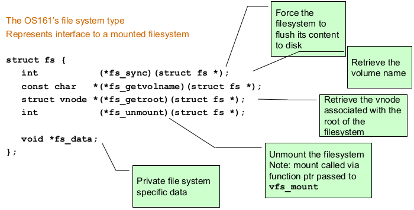
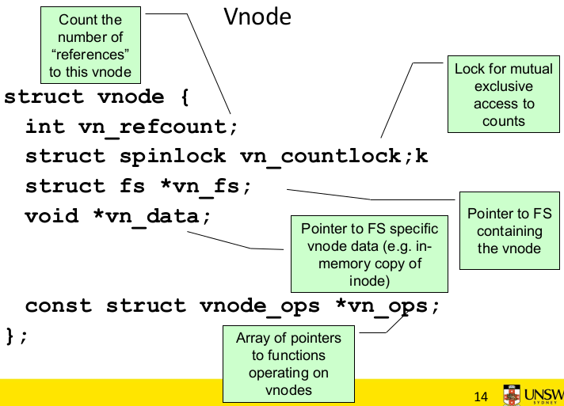
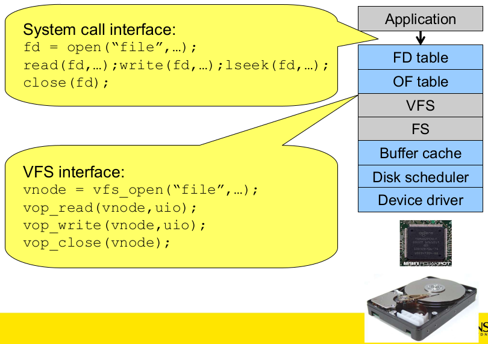
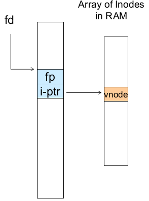
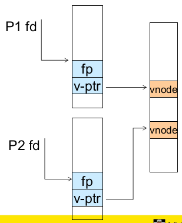
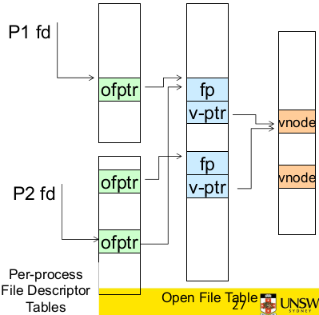
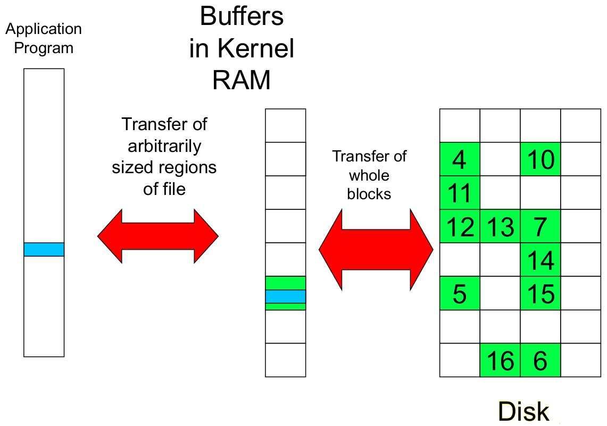
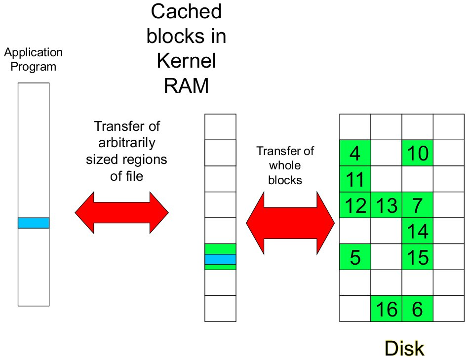

# File Management ctd.

Older systems only had a single file system. They had file system specific open, close, read, write and other calls. However modern systems need to support many file system types; e.g. ISO9660 (CDROM), MSDOS (floppy disk), ext2fs, tmpfs.

To support multiple file systems, we could change the file system code to understand different file system types. However this is prone to code bloat, complexity and in general being a non-solution.  
Instead we can provide a framework that separates file system independent and file system dependent code. This allows different file systems to be 'plugged in'. This is basically a **virtual file system**


## Virtual File System (VFS)

A **virtual file system (VFS)** provides a single system call interface for many file systems (e.g. UFS, Ext2, XFS, DOS, ISO9660, etc) and transparent handling of network file systems.  
It also provides a file-based interface to arbitrary device drivers (`/dev`) as well as to kernel data structures (`/proc`)

VFS can be thought of as an indirection layer for system calls (i.e. between the file operations requested by an application and the file system that happens to implement that request).Given that file operation table is set up at file open time, the VFS points to actual handling code for a particular request and further file operations are redirected to those functions.

The file system independent code deals with VFS and vnodes


### VFS Interface

The VFS interface has two major data tables:

* VFS - represents all file system types. It contains pointers to functions to manipulate each **file system** as a whole (e.g. mount, unmount) forming a standard interface to the file system
* vnode - represents a file (inode) in the underlying file system and points to the real inode. It also contains pointers to functions to manipulate **files/nodes** (e.g. open, close, read, write etc.)


### OS/161's VFS

OS/161's VFS interface:



OS/161's vnode interface:



Vnode operations:

``` C
struct vnode_ops {
    unsigned long vop_magic;    /* should always be VOP_MAGIC */

    int (*vop_read) (struct vnode *file, struct uio *uio);
    int (*vop_readlink) (struct vnode *link, struct uio *uio);
    int (*vop_getdirentry) (struct vnode *dir, struct uio *uio);
    int (*vop_write) (struct vnode *file, struct uio *uio);
    int (*vop_ioctl) (struct vnode *object, int op, userptr_t data);
    int (*vop_stat) (struct vnode *object, struct stat *stafbuf);
    int (*vop_gettype) (struct vnode *object, int *result);
    int (*vop_isseekable) (struct vnode *object, off_t pos);
    int (*vop_fsync) (struct vnode *object);
    int (*vop_mmap) (struct vnode *file /* add stuff */);
    int (*vop_truncate) (struct vnode *file, off_t len);
    int (*vop_namefile) (struct vnode *file, struct uio *uio);

    int (*vop_creat) (struct vnode *dir, const char *name, in excl, struct vnode **result);
    int (*vop_symlink) (struct vnode *dir, const char *contents, const char *name);
    int (*vop_mkdir) (struct vnode *parentdir, const char *name);
    int (*vop_link) (struct vnode *dir, const char *name, struct vnode *file);
    int (*vop_remove) (struct vnode *dir, const char *name, struct vnode *file);
    int (*vop_rmdir) (struct vnode *dir, const char *name);
    int (*vop_rename) (struct vnode *dir, const char *name);

    int (*vop_lookup) (struct vnode *dir, char *pathname, struct vnode **result);
    int (*vop_lookparent) (struct vnode *dir, char *pathname, struct vnode **result, char *buf, size_t len);
};
```

Note that most operations are on vnodes. To operate on file names, there is a higher level API on names that uses the internal `VOP_*`

``` C
int vfs_open(char *path, int openflafs, mode_t mode, struct vnode **ret);
void vfs_closeclose(struct vnode *vn);
int vfs_readlink(char *path, struct uio *data);
int vfs_symlink(char *contents, char *path);
int vfs_mkdir(char *path);
int vfs_link(char *oldpath, char *newpath);
int vfs_remove(char *path);
int vfs_rmdir(char *path);
int vfs_rename(char *oldpath, char *newpath);

int vfs_chdir(char *path);
int vfs_getcwd(struct uio *buf);
```

Example: OS/161 emufs vnode ops
``` C
/*
 * Function table for emufs files
 */
static const struct vnode_ops emufs_fileops = {
    VOP_MAGIC, /* mark this as a valid vnode ops table */

    emufs_eachopen,
    emufs_reclaim,

    emufs_read,
    NOTDIR, /* readlink */
    NOTDIR, /* getdirentry */
    emufs_write,
    emufs_ioctl,
    emufs_stat,
    emufs_file_gettype,
    emufs_tryseek,
    emufs_fsync,
    UNIMP, /* nmap */
    emufs_truncate,
    NOTDIR, /* namefile */

    NOTDIR, /* create */
    NOTDIR, /* symlink */
    NOTDIR, /* mkdir */
    NOTDIR, /* link */
    NOTDIR, /* remove */
    NOTDIR, /* rmdir */
    NOTDIR, /* rename */

    NOTDIR, /* lookup */
    NOTDIR, /* lookparent */
};
```

## File Descriptors & Open File Tables

The motivation to translate the standard file interface that application expect to the file interface that the VFS provides.



Each open file has a **file descriptor**. `read`, `write` `lseek` etc use them to specify which file to operate on. State associated with a file descriptor include:

* file pointer - the current offset in the file. Determines where in the file the next read or write is performed
* mode - was the file opened as a read-only file etc.

**Option 1:** Use vnode numbers as file descriptors and add a file pointer to the vnode.  
**Problems:** when we concurrently open the same file twice, we should get two separate file descriptors and file pointers, but we don't.



**Option 2:** Have a single global open file array, where the `fd` is an index in the array and each entry contains a file pointer (`fp`) and a pointer to a vnode (`v-ptr`).  
**Problems:** The file descriptor for `stdout` is 1. `stdout` is the console for some processes and a file for others. This means that entry 1 needs to be different per process.



**Option 3:** Each process has its own open file array.  
Each index contains a `fp` and `v-ptr`. File descriptor 1 can point to any vnode for each processes (i.e. console, a log file etc.)  
**Problems:** `fork()` defines that the child shares the file pointer with the parent. `dup2()` also defines the file descriptors share the file pointer. With the per-process table, we can only have **independent** file pointers, even when accessing the same file.



**Option 4:** Have a per-process file descriptor table with a global open file table.  
The per-process file descriptor array contains pointers to an open file table entry.  
The open file table array contains entries with an `fp` and `v-ptr`.  
This provides shared file pointers if required and independent file pointers if required.  
E.g. All three file descriptors refer to the same file, two share a file pointer, one has an independent file pointer.

Option 4 is used by Linux and most other Unix operating systems.

## Buffer Cache

The **buffer** is temporary storage used when transferring data between two entities. Especially when entities work a **different rate** or when the **unit of transfer is incompatible**. E.g. between an application program and disk



Buffering disk blocks allow applications to work with arbitrarily sized regions of a file. However apps cans still optimise for a particular block size.  
Writes can return immediately after copying to the kernel buffer. This avoid waiting until a "write to disk" is complete. The write is schedules in the background.  
We can implement a "read-ahead" by pre-loading the next block on disk into the kernel buffer. This avoids having to wait until the next read is issued.

Recall that **cache** is fast storage used to temporarily hold data to speed up repeated access to the data. e.g. main memory can cache disk blocks.



When we cache disk blocks, on access, before loading a block from the disk, we check if it is in the cache first. This avoid disk access. We can optimise for repeated access or several processes.

Buffering and caching are related.  
Data is read into a buffer; having an extra independent cache copy would be wasteful. So after use, the block should be cached. Future access may hit the cached copy. Caching utilised unused kernel memory space and may have to shrink depending on memory demand

The Unix buffer cache, on read:

1. hashes the device# and block#
2. checks if there is a match in the buffer cache
    1. if yes, it uses the in-memory copy
    2. if no, we load the block from disk into the buffer cache


When the cache is full and we need to read another block into memory, we must choose and existing entry to replace. For this we need a policy to choose a victim e.g. first-in, first-out (FIFO), least-recently-used (LRU) or others.

### File System Consistency

File data is expected to survive. A strict LRU policy could keep modified critical data in memory forever if it is frequently used.

Generally, cached disk blocks are priorities in terms of how critical they are to file system consistency.  
Directory blocks and inode blocks, if lost can corrupt entire file systems. e.g. imagine losing the root directory. These blocks are usually scheduled for immediate write to disk.  
Data blocks if lost corrupt only the file that they are associated with. These blocks are only scheduled for write back to disk periodically. In UNIX, `flushd` (flush daemon) flushes all modified blocks to disk every 30 seconds.

Alternatively, we can use a **write-through cache**; all modified blocks are written to disk immediately. This generates more disk traffic as temporary files are written back and multiple updates are not combined. This method is used by DOS. It gave okay consistency when floppy disks were removed from drives and when users were constantly resetting (or crashing) their machines. It is still used in USB storage devices.
