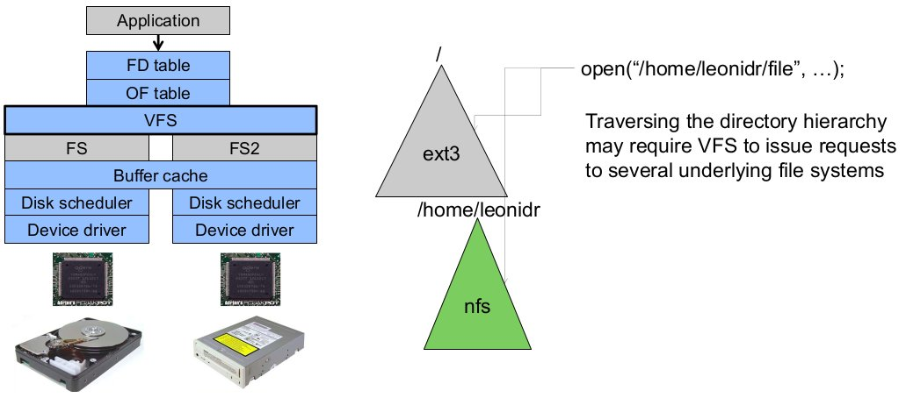
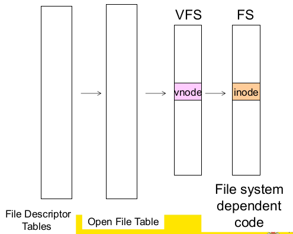
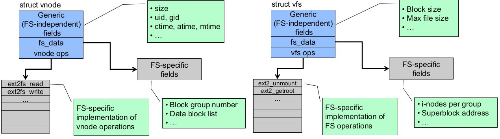

# File Management ctd.

Older systems only had a single file system. They had file system specific open, close, read, write and other calls. However modern systems need to support many file system types; e.g. ISO9660 (CDROM), MSDOS (floppy disk), ext2fs, tmpfs.

To support multiple file systems, we could change the file system code to understand different file system types. However this is prone to code bloat, complexity and in general being a non-solution.  
Instead we can provide a framework that separates file system independent and file system dependent code. This allows different file systems to be 'plugged in'. This is basically a **virtual file system**

## Virtual File System (VFS)

A **virtual file system (VFS)** provides a single system call interface for many file systems (e.g. UFS, Ext2, XFS, DOS, ISO9660, etc) and transparent handling of network file systems.  
It also provides a file-based interface to arbitrary device drivers (`/dev`) as well as to kernel data structures (`/proc`)

VFS can be thought of as an indirection layer for system calls (i.e. between the file operations requested by an application and the file system that happens to implement that request).Given that file operation table is set up at file open time, the VFS points to actual handling code for a particular request and further file operations are redirected to those functions.

The file system independent code deals with VFS and vnodes

### VFS Interface

The VFS interface has two major data tables:

* VFS - represents all file system types. It contains pointers to functions to manipulate each **file system** as a whole (e.g. mount, unmount) forming a standard interface to the file system
* vnode - represents a file (inode) in the underlying file system and points to the real inode. It also contains pointers to functions to manipulate **files/nodes** (e.g. open, close, read, write etc.)

