# Case Study: ext2 File System

**ext2** for extended file system was the main Linux file system before ext3. It was evolved from the Minix file system.

Features of the file system:

* its block size (1024, 2048, and 4096) is configured at file system creation
* it is an inode-based file system
* has performance optimisations to improve locality (from BSD Fast File System (FFS))

The main problem with ext2 was that an unclean unmount (e.g. os crashes, power-loss etc.) would result the `e2fsck` file system checker running, which would take a long time to run for large storage capacities. The ext3 file system fixed this by keeping a journal of (meta-data) updates. The journal is a file where updates are logged.

## Recap: inodes

Each file is represented by an inode on disk. The inode contains the fundamental file metadata; access rights, owner, accounting info, (partial) block index table of a file etc.  
Each inode has a unique number; a system oriented name (try `ls -i` on Unix-based systems)  
Directories map file names to inode numbers; i.e. it maps human-oriented to system-oriented names


### ext2 inodes

ext2 inodes contain:

* mode - the type (e.g. regular file or directory) and access mode (e.g. rwxrwxrwx)
* uid - user ID
* guid - group ID
* atime - time of **last access**
* ctime - time when file was **created**
* mtime - time when file was **last modified**
* size - the offset of the **highest byte** written
* block count - the number of disk blocks used by the file. Note: that the number of blocks can be much less than expected given the file size. Files can be sparsely populated  
e.g. `write(f, "hello");lseek(f,1000000);write(f,"world");` only needs to store the start and end of the file, not all the empty blocks in between; so `size=1000005` and `blocks=2+any indirect blocks`
* reference count - see [hard links](#hard-links)
* direct blocks - see [below](#unix-inode-block-addressing-scheme)
* single indirect - see [below](#unix-inode-block-addressing-scheme)
* double indirect - see [below](#unix-inode-block-addressing-scheme)
* triple indirect - see [below](#unix-inode-block-addressing-scheme)

### Unix Inode Block Addressing Scheme

Direct blocks store the block numbers of the first 12 blocks in the file; we can find the blocks _directly_ from the inode


We store offsets greater than the 12 blocks using indirection.

**Single indirection** is where we store the block number of a block which contains block numbers where higher offsets are stored. It requires two disk accesses to read; one for the indirect block and one for the target block.  
Our max file size, assuming 1Kbyte block size and 4byte block numbers is `12*1K + 1K/4 *1K = 268KiB`.

In **double indirection** we store the block number of a block containing block numbers of blocks containing block numbers.

In **triple indirection** we store the block number of a block containing block numbers of blocks containing block numbers of blocks containing block numbers.

Visually that would look like this:

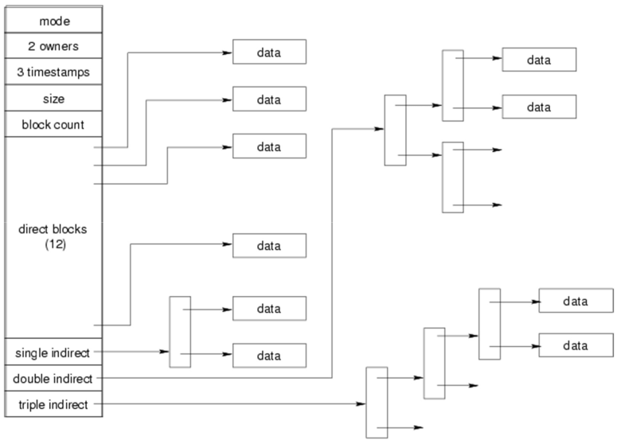

Example: assume we have 8 byte blocks, containing 4 byte block numbers. So we can store 2 block numbers in each block using a 1-bit index. Assume that we have a single direct block

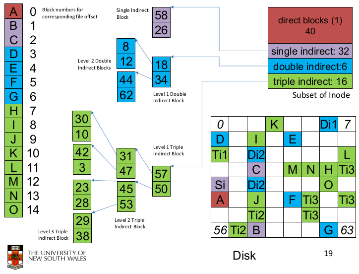

Example: assume we have 4 byte block numbers and 1K blocks.  
``` txt
The number of addressable blocks is  
direct blocks = 12  
single indirection = 256
double indirection = 256*256 = 65536
triple indirection = 256*256*256 = 16777216
So, max file size = 12 + 256 + 65536 + 16777216 = 16843020 blocks ≈ 16 GB
```

Example: where is the data block number stored?  
Assume we have 4K blocks, 4 byte block numbers and 12 direct blocks

``` C
// A 1 byte file is produced by
lseek(fd, 1048576, SEEK_SET); /* 1 megabyte */ 
write(fd, "x", 1);

// Then we add
lseek(fd, 5242880, SEEK_SET); /* 5 megabytes */
write(fd, "x", 1);
```

Solution: 4K blocks, and 4 byte block numbers, means we have 1024 block numbers in our indirect blocks (10-bit index)

| block # range                     | location           |
| ---                               | ---                |
| `0-11`                            | direct blocks      |
| `12-1035(12+1024)`                | single indirection |
| `1036-1049611(1035+1024*1024)`    | double indirection |
| `1049611-???`                     | triple indirection |

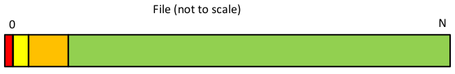

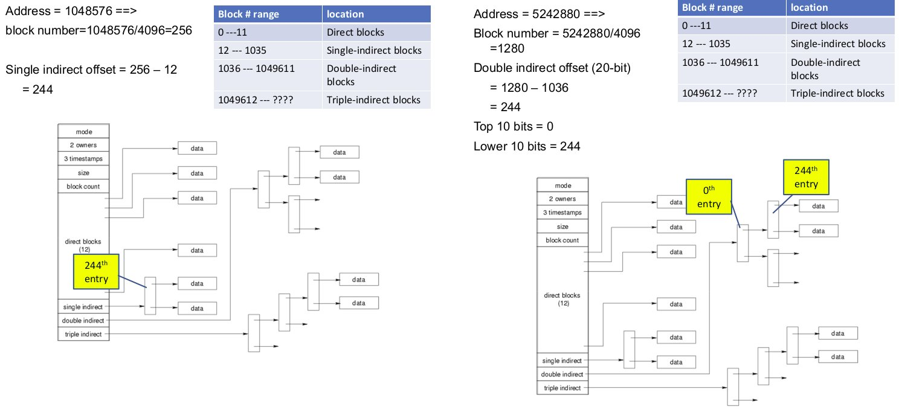

#### Best and Worst Cases

Assume the inodes are already in memory

Some best and worst case access patterns:

To read 1 byte:  
**best:** 1 access via a direct block  
**worst:** 4 accesses via the triple indirect block

To write 1 byte:  
**best:** 1 write via a direct block (with no previous content)  
**worst:** 4 reads (to get the previous contents of the block via triple indirection) + 1 write (to write the modified block back)

Worst case access patterns with unallocated indirect blocks

Worst to write 1 byte:

* 4 writes (3 indirect blocks; 1 data)
* 1 read, 4 writes (read-write 1 indirect, write 2, write 1 data)
* 2 reads, 3 writes (read 1 indirect, read-write 1 indirect, write 1; write 1 data)
* 3 reads, 2 writes (read 2, read-write 1; write 1 data)

Worst to read 1 byte

* if reading writes a zero-filled block on disk
* worst case is the same as write 1 byte
* if not, worst-case depends on how deep current indirect block tree is

### Summary

The inode (and indirect blocks) contain the on-disk metadata associated with a file. It contains the mode, owner and other bookkeeping details.
It is efficient at random and sequential access via _indexed allocation_. Small files, which is the majority of files, require only a single access. Larger files require progressively more disk accesses for random accesses, but sequential access is still efficient. It can support really large files via increasing levels of indirection.

## Storing Inodes and File System Layouts

The **System V Disk layout (s5fs)** contains the following section in its layout:

* **boot block** containing code to bootstrap the OS and get the machine running
* **super block** containing attributes of the file system itself. e.g. size, number of inodes, the start block of the inode array, the start of the data block area, the free inode list, free data block list etc.
* **inode array**
**data blocks**

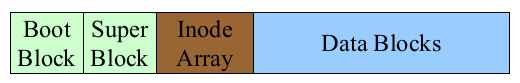

Some issues with s5fs' layout:

* having inodes at the start of the disk and data blocks at the end of the disk means we can have long seek times; we must read the inode before reading data blocks
* only one super block - a corrupt super block means the entire file system is lost
* block allocation is sub-optimal - the consecutive free block list is created at file system format time. Allocation and de-allocation eventually **randomises** the list resulting in random allocation
* inode free list is also randomised over time - directory listing resulted in random inode access patterns

The **Berkeley Fast File System (FFS)** historically followed s5fs. It addressed most of the limitations of s5fs and ext2fs is mostly similar to it.

### ext2 File System Layout

The **ext2 file system** is partitioned as follows:


* a reserved boot block
* a collection of equally sized **block groups**, where all block groups have the same structure

Each block group has the following layout:

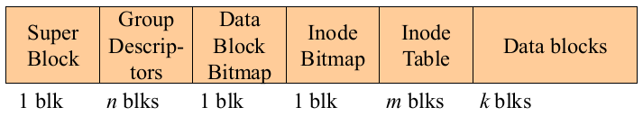

* **replicated** super blocks for `e2fsck`
* group descriptors
* bitmaps used to identify free inodes/blocks
* data blocks of the same number for all block groups

The advantage of this structure is that replication simplifies recovery and the proximity of inode tables and data blocks reduces seek time

#### Super Blocks

Super blocks contain the size of the file system, block size, and similar parameters. It also contains an overall (list?) of free inode and block counters.  
It has data indicating whether a file system check is needed:

* uncleanly mounted
* inconsistency
* certain number of mounts since last checked
* certain time expired since last check

It is also replicated to provide **redundancy** to aid **recoverability**

#### Group Descriptors

Group descriptors have:

* the location of bitmaps
* a counter for free blocks and inodes in this group
* the number of directories in the group

#### Performance Considerations

ext2's optimisations:

* block groups cluster related inodes and data blocks
* pre-allocation of blocks on write (up to 8 blocks); 8 bits in bit tables; better contiguity when there are concurrent writes
* aim to store files within a directory in the same group

## ext2 File System Directories


**Directories** are files of a special type; consider it a file of a special format, managed by the kernel that uses most of the same machinery to implement it.

Directories translate names to inode numbers. Directory entries are of variable length and entries can be deleted in place by having a special inode number, `0`, to mean "there is nothing here".

Suppose our directory contains the following:

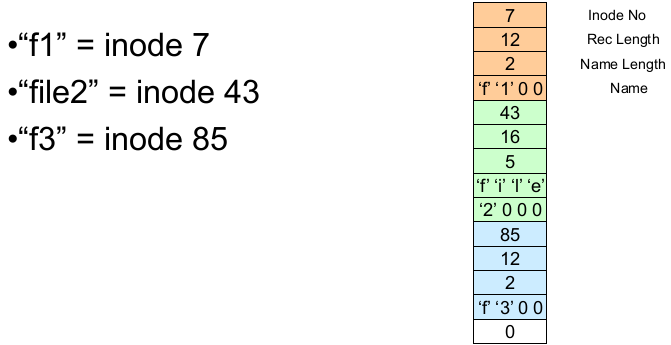

### Hard Links

Inodes can have more than one name. This is known as having a **hard link**.

In our sample directory, inode 7 has three names; "f1", "file2" and "f3" all refer to inode 7.

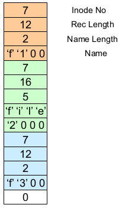

We can have many names for the same inode. A count of references (the **reference count**) is kept in the inode.  
Adding a name (directory entry) referring to the inode increments the count and removing a name decrements the count. If the reference count is 0, then we have no names for the inode (it is unreachable) and we can delete the inode (i.e. the underlying file or directory)

When an inode has a positive reference count, the inode with still _exist_ despite one of its references being deleted.

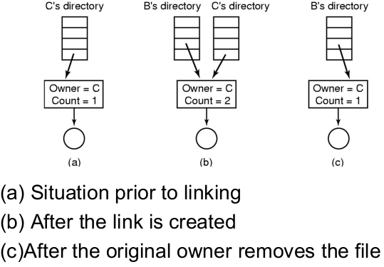

### Symbolic Links

A **symbolic link** or **symlink** is a file that contains a reference to another file or directory.

It has its own inode and data block, which contains a path to the target file. A symlink is marked by a special file attribute, is transparent for some operations and can point across file system boundaries. 

Symlinks can contain paths to other symlinks essentially creating a linked list. Issues arise when a cyclical list is created or when a stored path is invalid. To deal with an endless path lookup a symlink lookup limit is imposed.

### Deleting a Filename

When deleting a file name (e..g `rm file2`), we adjust the record length to skip to the next valid entry

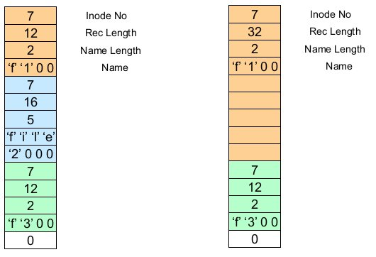

## File System Reliability

In ext2, disk writes are buffered in RAM, so an OS crash or power outrage results in lost data.  
ext2 commits writes to the disk periodically (e..g every 30 seconds) and uses the `sync` command to force a file system flush. The file system operations are non-atomic, so a incomplete transaction can leave the file system in an inconsistent state.

Let us go through an example where we try to find the optimal order of actions for deleting an file to deal with an operating system crash.

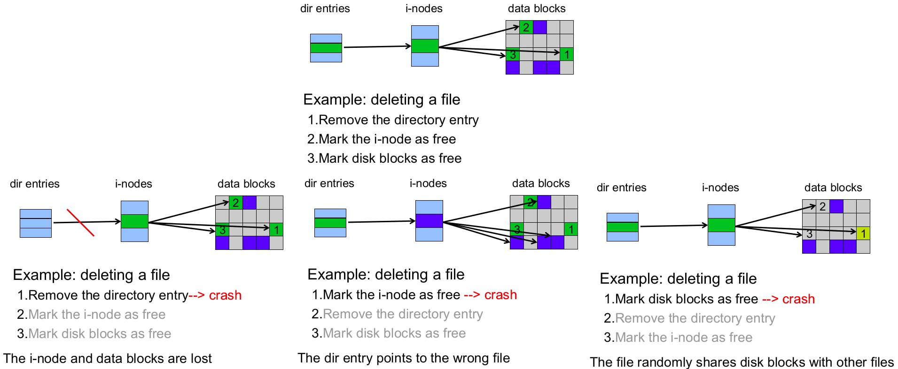

It turns out there is no good ordering. :(

When the file system realises it has had an unclean unmount, it uses e2fsck to scan the disk and attempt to restore file system invariants. However this is inefficient.

A solution to this is journaling file systems like ext3.  
It keeps a journal of file system updates. Before performing and atomic update sequence, it writes it to the journal. On an unclean shutdown, it replays the last journal entries
