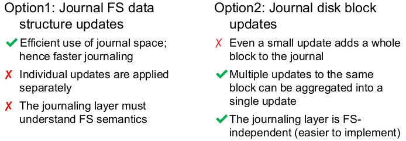
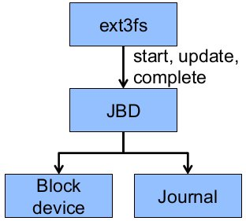
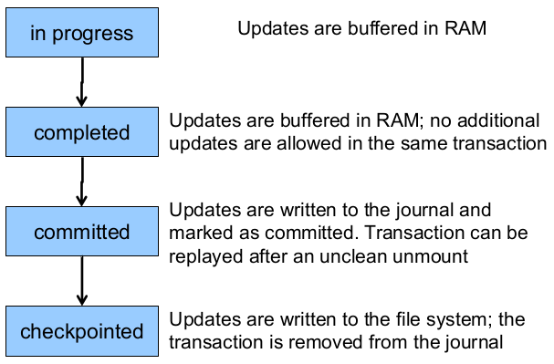

# Case Study: ext3 File System

Specifically, a look at journaling in the ext3 file system.

The design goals of the ext3 file system was to:

* add journaling capability to the ext2 file system
* have backward and forward compatibility with ext2 so that existing ext2 partitions can be mounted as ext3
* leverage the proven ext2 performance
* reuse most of the ext2 code base
* reuse ext2 tools, including `e2fsck`

## The ext3 Journal

When journaling we can have two approaches:

**Option 1:** Journal file system data structure updates. Example:

``` txt
start transaction
    delete dir entry
    delete inode
    release blocks 32, 17, 60
end transaction
```

**Option 2:** Journal disk block updates. Example

``` txt
start transaction
    update block #n1 (contains the dir entry)
    update block #n2 (inode allocation bitmap)
    update block #n3 (data block allocation bitmap)
end transaction
```

ext3 implements option 2



### Journal Block Device (JBD)

The ext3 journal is called **Journaling Block Device (JBD)**.  
The JBD interface:

* **starts** a new transaction
* **updates** a disk block as part of a transaction
* **completes** a transaction; completed transactions are buffered in RAM
* **commits** (writes) transaction data to the journal (persistent storage); **multiple** file system transactions are committed in one go
* **checkpoint**; flush the journal to the disk; used when the journal is full or the file system is being mounted



The transaction lifestyle:



The JBD can keep the journal on a block device or in a file. This enables compatablity with ext2 (since the journal is just a normal file).

JBD is independent of ext3 specific data structures:

* separations of concerns - the file system maintains on-disk data and metadata; JBD takes care of journaling
* code reuse - JBD can be used by any other file system that requires journaling

### Journaling Modes

ext3 supports two journaling modes:

* **metadata + data** - enforces atomicity of all file system operations
* **metadata journaling** - only metadata is journalled; data blocks are written directly to the disk
    * improves performance
    * enforces file system integrity
    * does not enforce atomicity of `write`s (new file content can be stale blocks)
