# Memory Management

Processes have one or more threads of execution and require resources for execution:

* Memory (RAM) - program code ("text"), data (initialised, uninitialised, stack), buffers held in the kernel on behalf of the process
* Others - CPU times, files, disk space, printers etc.

The operating system keeps track of what memory is in use and what memory is free. It allocates free memory to processes when needed and deallocates it when it isn't needed. It manages the transfer of memory between RAM and disk.

Ideally, programmers want memory that is **fast**, **large**, **non-volatile**. This is not possible. Memory management coordinates how the memory hierarchy is used, where the focus is usually on RAM to the disk.

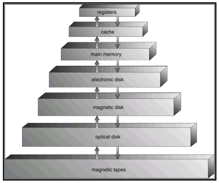

There are two broad classes of memory management systems. Those that

* **transfer processes to and from external storage during execution** - called swapping or paging
* **do not transfer processes** - simple and usually found in embedded devices, dumb phones or smart cards.

## Basic Memory Management - Monoprogramming

This is monoprogramming without swapping or paging.

There are three simple ways of organising memory for an operating system with one user process.

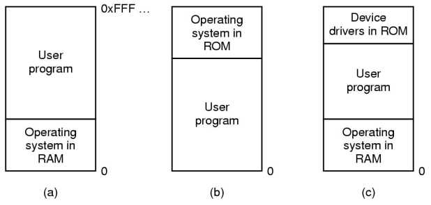

This is okay if we only have one thing to do and the memory available approximately equates to memory required  
Otherwise, it has poor CPU utilisation in the presence of I/O waiting and poor memory utilisation with a varied job mix.

## Multiprogramming

Recall that an operating system aims to:

* maximise memory utilisation
* maximise CPU utilisation (ignoring battery/power management issues)

We can subdivide memory and run more than one process at once. This is known as multiprogramming or multitasking.

Given a workload, we need to keep track of free memory and locate free memory for a new process.

The overview of evolution of simple memory management:

* **static** (fixed partitioning) approaches - simple, predictable workloads of early computing
* **dynamic** (partitioning) approaches - more flexible computing as computing power and complexity increased

### Fixed Partitioning

**Approach 1:** divide memory into **_fixed equal-sized_** partitions. Any process smaller than or equal to the partition size can be loaded into any partition. Partitions are free or busy.

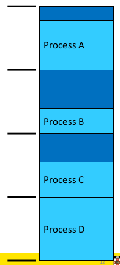

Any unused space in the partition is wasted (internal fragmentation). Processes smaller than main memory but larger than a partition cannot run.

**Approach 2:** **_fixed, variable-sized_** partitions. We divide memory at boot time into a selection of different sized partitions. We can base the sizes on expected workloads. Each partition has a queue. We place a process in the queue for the smallest partition that it fits in. Processes then wait for when the assigned partition is empty to start.

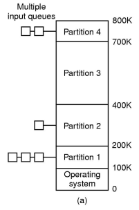

An issue here is that some partitions may be idle; we may have small jobs available and queued but a large partition free. Workloads are unpredictable and may not be efficiently used

**Approach 3:** **_fixed variable-sized_** partitions **_with a single queue_**. We have a single queue where we search for a partition that fits the job. This means small jobs may be allocated large partitions if necessary. However this increases internal memory fragmentation.

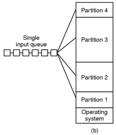

To summarise, fixed partitioning is simple and easy to implement. However it can result in poor memory utilisation due to internal fragmentations.

This approach is used on IBM System 360 operating system (OS/MFT) announced in 6 April, 1964. It is still applicable to simple embedded systems, where static workloads are known in advance.

### Dynamic Partitioning

In dynamic partitioning, partitions are of **_variable length_** and are allocated **_on-demand_** from ranges of free memory. A process is allocated exactly what it needs and it is assumed a process knows what it needs.

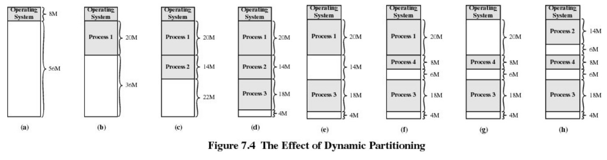

In the diagram above, we have 16MB free at (h), but it can't be used to run any more processes requiring more than 6MB as it is fragmented. Hence we have external fragmentation since we have unusable holes.

Dynamic partition allocation algorithms are also applicable to `malloc()` like in-application allocators.  
Given a region of memory, basic requirements are:

* quickly locate a free partition satisfying the request (minimise CPU time search)
* minimise external fragmentation
* minimise memory overhead of bookkeeping
* efficiently support merging two adjacent free partitions into a larger partition

A classic approach to keep track of free memory is to represent available memory as a linked list of available "holes" (free memory ranges). For each hole we store the base and size. We keep the holes in order of increasing address. This simplifies the merging of adjacent holes into larger holes. The list nodes are stored in the "holes" themselves.

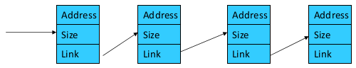

As a result there are four neighbour combinations for the terminating process X when we want to coalesce free partitions in a linked list.

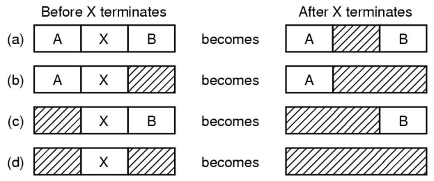

Dynamic partitioning placement algorithms using the list of "holes".

**Approach 1:** First-fit algorithm  
We scan the list for the first entry that fits. If the size is greater, we break it into an allocated and free part. The intent is to minimise the amount of searching performed.  
This aims to find a match quickly and biases allocation to the beginning of memory and tends to preserve larger blocks at the end of memory.

**Approach 2:** Next-fit algorithm  
Like first-fit, except it begins its search from the point in the list where the last request succeeded instead of at the beginning.  
This has (flawed) the intuition of spreading allocation more uniformly over the entire memory to avoid skipping over small holes at the start of memory. It performs worst that first-fit as it breaks up the large free space at the end of memory.

**Approach 3:** Best-fit algorithm  
Chooses the block that is closest in size to the request  
It performs worse that first-fit because it has to search the entire list. Since the smallest block is chosen for a process, the smallest amount of external fragmentation is left, creating a lot of unusable holes.

**Approach 4:** Worst-fit algorithm  
Chooses the block that is the largest in size (worst-fit). The idea is to leave a unusable fragment left over.  
It is also a poor performer since it has more work to do (like best-fit) to search the entire list. It also does not result in significantly less fragmentation.

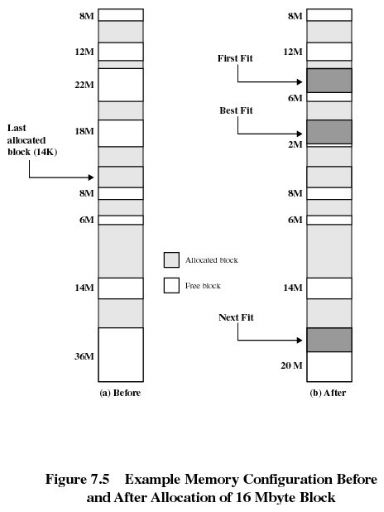

In summary, first-fit is generally a better solution than the others mentioned and it is easier to implement.  
They are simple solutions to still-existing operating systems or application services/functions for memory allocation.  
Note that they have largely been superseded by more complex and specific allocation strategies. Typically in-kernel allocators used are _lazy buddy_ and _slab allocators_

#### Compaction

We can reduce external fragmentation by compaction. That is we shuffle memory contents to place all free memory together in one large block. We can do this only if we can relocate running programs. This generally requires hardware support.

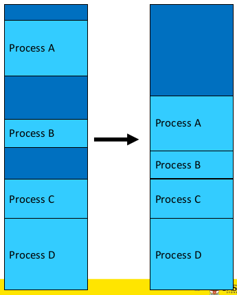

#### Relocation and Protection

We haven't addressed how a process runs in different locations in memory and how we prevent processes from interfering with each other.

To deal with this we have **logical addresses** refer to locations within the program. Once running, these addresses must refer to the real physical memory.

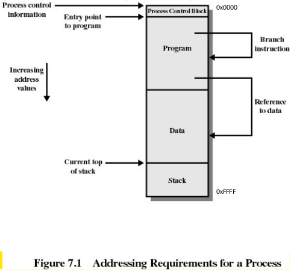

The logical addresses can be bound to physical memory at:

* **compile/link time** - the compiler/linker binds the address and must know the "run" location at compile time (in other words the executable contains the corresponding physical addresses for the process). This means we can only **_run one copy_** of the process and it can only **_run at one_** location. We need to recompile if the location changes
* **load time** - the compiler generates **_relocatable_** code. Addresses are annotated and the loader binds the address to the correct location at load time. This slows start up and increases the executable file size
* **run time** - logical compile-time addresses are translated to physical addresses by _special hardware_. The cost of translating every memory reference is high

##### Hardware Support for Runtime Binding and Protection

For process B to run using logical addresses, process B expects to access addresses from 0 to some limit of memory size. We need to add an appropriate offset to its logical adddress to achieve relocation and protect memory "lower" than B. We must also limit the maximum logical address B can generate to protect memory "higher" than B.

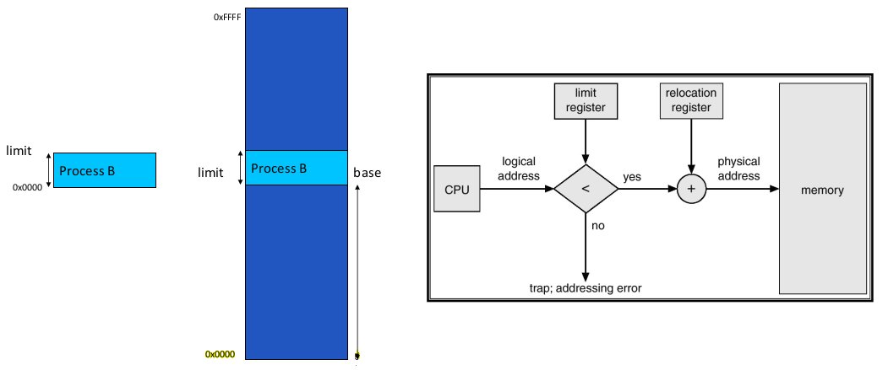

To deal with this we have **base and limit registers** (also called **base and bound registers** and **relocation and limit registers**. Base and limit registers restrict and relocate the currently active process. Base and limit registers must be changed at load time, relocation (compaction time) or on a context switch.

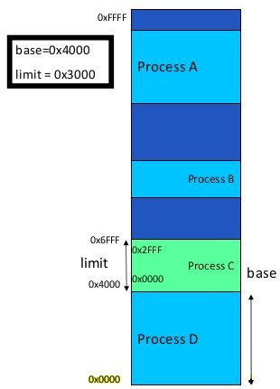

Pros include:

* supports protected multi-processing/multi-tasking

Cons include:

* physical memory allocation must still be contiguous
* the entire process must be in memory
* does not support spatial sharing of address space; no shared code, libraries, or data structures between processes

### Swapping

So far, we have a system suitable for a batch system; limited number of dynamically allocated processes enough to keep the CPU utilised; relocated at runtime; protected from each other.

We need more than just a small number of processes running at once. We need to support a mix of active and inactive processes of varying longevity

A process can be **swapped** temporarily out of memory to a **backing store** and then brought back into memory for continued execution.  
The **backing store** is a fast disk large enough to accommodate copies of all memory images for all users. It must provide direct access to these memory images.  
We can prioritised processes; lower-priority processes can be swapped out so that a higher-priority process can be loaded and executed.  
A major part of swap time is transfer time; the total transfer time is directly proportional to the _amount_ of memory swapped.

A schematic view of swapping:

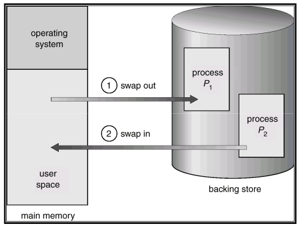
