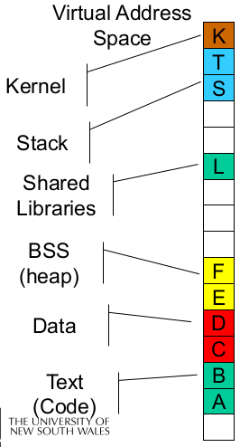
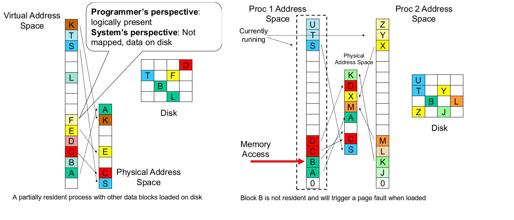
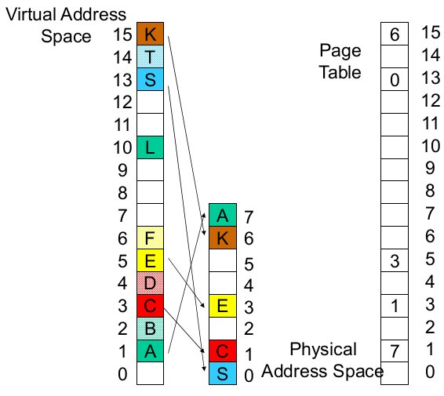
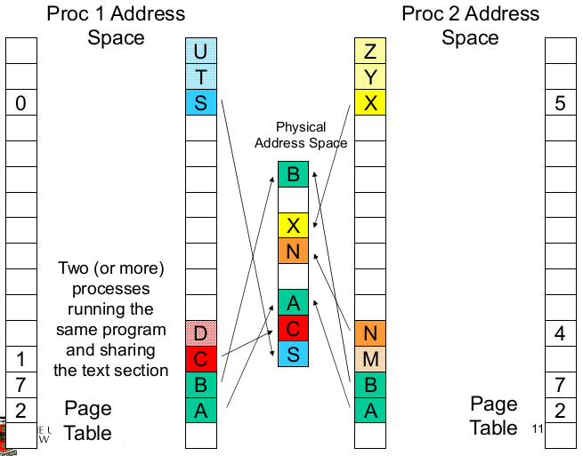
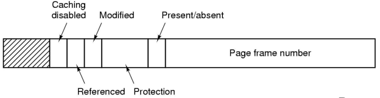
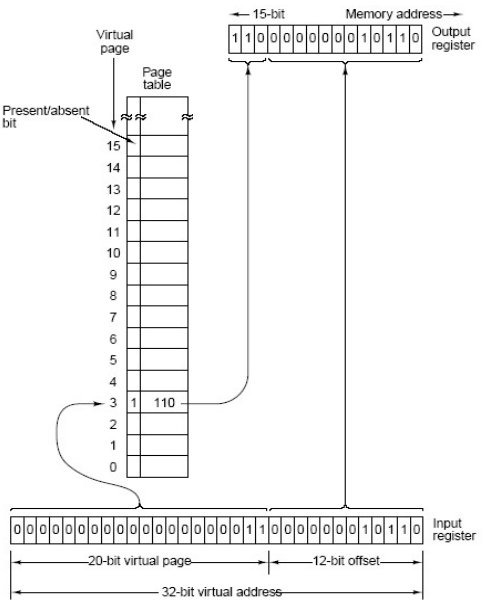
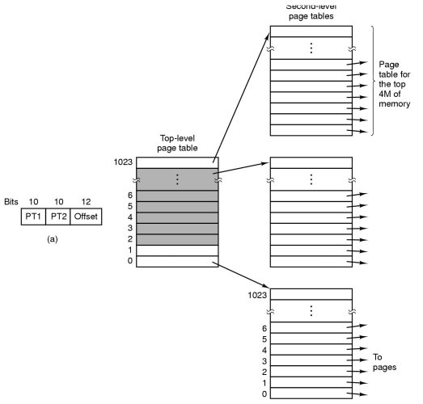
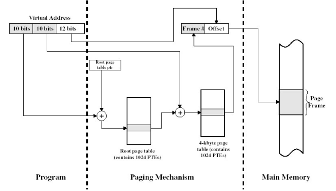

# Virtual Memory

## Overview

**Virtual memory** is divided into equal sized **_pages_**.  
A **_mapping_** is a translation between a page and a frame, and a page and null. Mappings are defined at runtime, although they can change.  
The address space can have holes.  
The process does not have to be contiguous in physical memory

The **physical memory** is divided into **_frames_**.

A typical address space layout consists of:

* the stack region at the top, growing down
* the heap as free space, growing up
* text as (typically) read-only
* the kernel reserved and protected as a shared region

The 0th page is typically not used as `NULL` pointers generally point to this address and if accessed can be successfully dereferenced.

A process may be only partially resident (i.e. loaded to the physical address space). This allows the OS to store individual pages on disk and saves memory for infrequently used data and code

If we access non-resident memory, we will get a **page fault**. This occurs when we reference an invalid page and is an exception handled by the OS.  
Broadly there are two standard page fault types:

* **illegal address** (protection error) - signals or kills the process
* **page not resident** - will get an empty frame, loads the page, updates the page (translation) table (enter frame #, set valid bit, etc.), restart the faulting instruction

A page table for resident parts of the address space:

### Shared pages

Generally each process has their own copy of code and data, which can appear anywhere in the address space. It is possible to have shared code (e.g. a system library) where a single copy of code is shared between all processes executing it. The code itself **must not be self modifying** and **must appear at the same address in all processes**

### Page Table Structure

A **page table** is (logically) an array of frame numbers indexed by a page number. Each **page-table entry (PTE)** also has other bits:

* **present/absent bit** - also called a **valid bit**, which indicated a valid mapping for the page
* **modified bit** - also called a **dirty bit**, which indicates that a page may have been modified in memory; useful for loading blocks from disk; e.g. if a block has not been modified, we do not need to retrieve it from the disk
* **reference bit** -  indicates the page has been accessed; useful for choosing which pages to remove
* **protection bit** - a combination of read, write, execute permissions
* **caching bit** - used to indicate whether the processor should bypass the cache when accessing memory; e.g. to access device registers or memory

### Address Translation

Every (virtual) memory address issued by the CPU must be translated to physical memory; every _load_ and every _store_ instruction, every instruction fetch. To be able to do this be need translation hardware.

In the paging system, translation involves replacing the page number with a frame number.

### Overview Summary

Virtual and physical memory are 'chopped' into equal sized pages and frames respectively.

Programs use **virtual** addresses, which are mapped to physical addressed by the Memory Management Unit (MMU).

It first checks if the page is present (present/absent but).  
If **yes**, the address in the page table form MSBs in physical address  
If **no**, trigger a page fault and bring in the page from disk

## Page Tables

Assume we have:

* a 32-bit virtual address (2^32 = 4 Gbyte address space)
* 4 Kbyte page size

We would have `2^32 / 2^12 = 2^20` page table entries each with a `2^12` offset.

Now, assume we have:

* a 62-bit virtual address space (a humongous address space)
* 4 Kbyte page size

We would have `2^64 / 2^12 = 2^52` page table entries.

Our page table would be **very** large.

Page tables are implemented as data structures in main memory. Most processes do not use the full 4GB address space; e.g. 0.1 – 1 MB text, 0.1 – 10 MB data, 0.1 MB stack

We need a compact representation that does not waste space, but is still very fast to search. There are three basic schemes:

* use data structure that adapt to sparsity
* use data structures which only represent resident pages
* use VM techniques for page tables (covered in extended OS)

### Two-level Page Table

The **two-level page table** is a page table which adapts to sparsity. Unmapped pages are not allocated.

Instead of accessing the page table via a single page number, we split the page number into high-order and low-order bits, and use those bits to index the **top-level** and **second-level** page tables respectively

### Inverted Page Table

An **inverted page table** has an array of page numbers indexed by frame numbers (it's frame table).

The algorithm:

1. Compute the has of a page number
2. Extract the index from the has table
3. Use this index in the inverted page table
4. Match the PID and page number in the IPT entry
    1. If it matches, use the index value as the frame number fro translation
    2. If it doesn't match, get the next candidate IPT entry from the chain field
    3. If`NULL` chain entry, trigger a page fault
