# Multiprocessors

We will look at **shared-memory multiprocessors** (i.e when multiple processors share the same memory. A single CPU can only go so fast. If we use more than one CPU, it is possible to improve performance. This is based on the assumption that workload can be panellised and is not I/O bound or memory bound. 

Recall **Amdahl's Law**, where given a portion _P_ of a program that can be made parallel, and the remaining portion _(1-P)_, sped up by using _N_ processors

The speedup = `1/((1-P)+P/N)`

Given a program, which runs in serial 50% of the time and in parallel for the other 50%, If we use 2 processor the speed up becomes `1/(0.5 +0.5/2) = 1.33...`

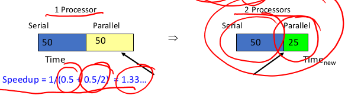

If the number of processors tends towards infinity, the speed up becomes `1/(0.5 + 0) = 2`

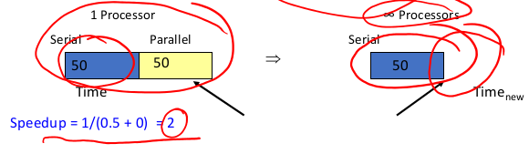

Types of multiprocessors:

* UMA MP (**Uniform Memory Access**) - access to all memory occurs at the same speed for all processors
* NUMA MP (**Non-uniform Memory Access**) - access to some parts of memory is faster for some processors than other parts of memory

We will be focusing on UMA multiprocessors

## Bus Based UMA

A **Bus Based UMA** is the simplest multiprocessor, where more than one processor is on a single bus connected to memory. The bus bandwidth becomes a bottle neck with more than just a few CPUs.

Each processor has a cache to reduce its need to access to memory. The hope is tha most accesses are to the local cache. Even so, the bus bandwidth still becomes a bottle neck with many CPUs.

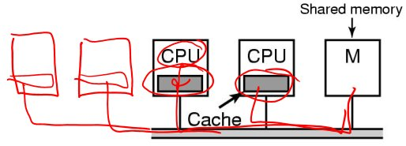

With caches comes the problem of cache consistency. If one CPU writes to address `0x1234` (and it is stored in its cache) and another CPU reads from the same address (and gets what is in its cache), the values will be inconsistent.

**Cache consistency** is usually handled by the hardware. Writes to one cache propagate to, or invalidate appropriate entries on other caches. These cache transactions also consume bus bandwidth.

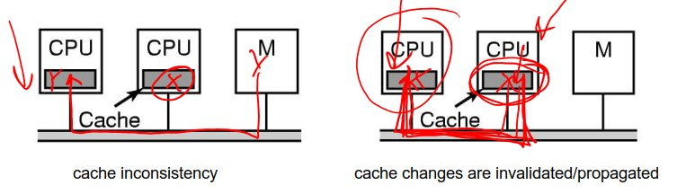

With only a single shared bus, scalability can be limited by the bus bandwidth of the single bus, even with the help of caching. Alternative bus architectures do exist; they do improve the bandwidth available, but do not eliminate the constraint that the bandwidth is limited

Another bus architecture: multi-core processor

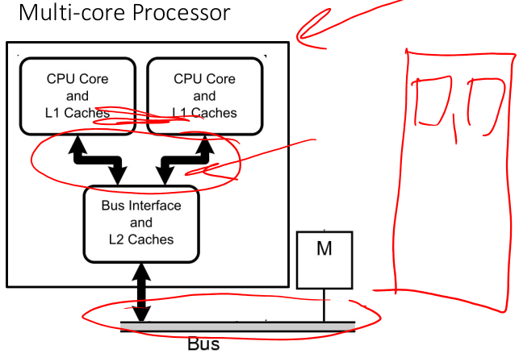

In summary, multiprocessors can increase computation power beyond that available from a single CPU. It shares resources such as disk and memory.  
However, it works under the assumption that parallelisable workload is effective and not I.O bound. The shared buses (bus bandwidth) limits scalability, but can be reduced via hardware design, and by carefully crafting software behaviour. E.g. good cache locality together with limited sharing where possible

## Operating Systems for Multiprocessors

### An OS per CPU

In this each CPU has its own OS. They statically allocate physical memory to each CPU and each CPU runts its on independent OS. Peripherals are shared, but each CPU (OS) handles its process system calls.

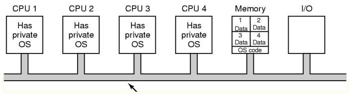

This was used in early multiprocessor systems to "get them going". It has the following features

* **simple** to implement
* **avoids** CPU-based **concurrency issues** by not sharing
* **scales** 0 no shared serial sections

It is a modern analogy to virtualisation in the cloud

It does that have following issues though:

* each processor has its own scheduling queue; we can have one processor overloaded and the rest idle
* each processor has its own memory partition; he can have one processor thrashing, and the others free with memory; there is no way to move free memory from one os to another

### Symmetric Multiprocessors

In **Symmetric Multiprocessors (SMP)**, the OS kernel runs on all processors. The load and resources are balanced between all processors (including kernel execution).

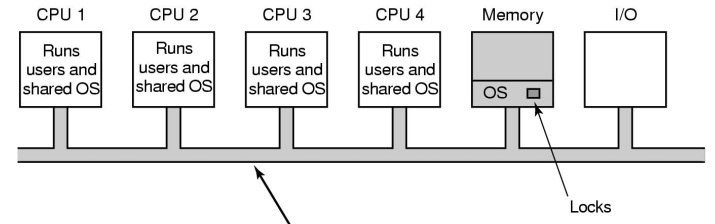

The issue of **concurrency in the kernel** arises. We need carefully applied synchronisation primitives to avoid disaster.

**Solution 1**: a single mutex that will make the **entire** kernel a critical section  
Only one CPU can be in the kernel at any time. The "big lock" becomes a bottleneck when in-kernel processing exceeds what can be done on a single CPU.

**Solution 2**: identify large independent parts of the kernel and make each of them their own critical section  
This allows for more parallelism in the kernel.  
It is difficult to implement since the code is mostly similar to uniprocessor code. The hard part is identifying independent parts that don't interfere with each other (recall the [spaghetti monster](https://github.com/hillaryychan/COMP3231/blob/master/imgs/1-22_monolithic-os-structures.jpg) or inter-dependencies between OS subsystems)

Example: associate a mutex with independent parts of the kernel. Some kernel activities require more than one part of the kernel. This means we will need to acquire more than one mutex, which is _great_ opportunity to deadlock.  
Overall, it results in a potentially complex lock ordering scheme that must be adhered to.

Example: given a "big lock" kernel, we divide the kernel into two independent parts with a lock each. There is a good chance that one of those locks will become the next bottleneck. This leads to more subdivision, more locks, and more complex lock acquisition rules. Subdivisions in practice is making more code multithreaded (parallelised)

An example in real life covering scalability:

Early 1990’s, CSE wanted to run 80 X-Terminals off one or more server machines.  
The winning tender was a 4-CPU bar-fridge-sized machine with 256M of RAM. This was eventually configured to 6-CPU and 512M of RAM. The machine ran fine in all pre-session testing.  
However the combination of students and assignment deadlines made the machine unusable. 

To fix the problem, the tenderer supplied more CPUs (increasing the number to 8) to improve performance, yet there was no change.

Eventually, the machine was replaced with three 2-CPU pizza-box-sized machines, each with 256M RAM. It was cheaper overall and performance improved dramatically. **Why?**  

The 4-8 CPU machine hit a bottleneck in the single threaded virtual memory code. Adding more CPUs simple added them to the wait queue for the virtual memory locks and made other wait longer.  
The 2 CPU machines did not generate that much lock contention and performed proportionally better

**Lessons**: building scalable multiprocessor kernels is hard; lock contention can limit overall system performance

It should also be noted that SMP Linux followed a similar evolution

* Linux 2.0 Single kernel big lock (1996)
* Linux 2.2 Big lock with interrupt handling locks
* Linux 2.4 Big lock plus some subsystem locks
* Linux 2.6 most code now outside the big lock, data-based locking, lots of scalability tuning, etc, etc..
* Big lock removed in 2011 in kernel version 2.6.39

## Multiprocessor Synchronisation

To achieve synchronisation on a multiprocessor machine, we cannot simply disable interrupts like we do in uniprocessors. This does not prevent other CPUs from running in parallel. We need special hardware support.

Recall the mutual exclusion via test-and-set:

``` assembly
enter region:
    TSL REGISTER,LOCK   | copy lock to register and set lock to 1
    CMP REGISTER,#0     | was lock zero?
    JNE enter_region    | if it was non-zero, lock was set, so loop
    RET                 | return to caller; critical region entered

leave_region:
    MOVE LOCK,#0        | store a 0 in lock
    RET                 | return to caller
```

Hardware guarantees that the instruction execute atomically on a CPU, but this does not work on a SMP without some extra hardware support.

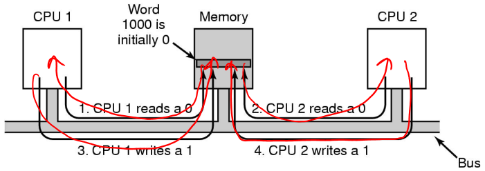

A solution would be to have hardware block all other CPUs from accessing the bus during the TSL instruction to prevent memory accesses by any other CPU. TSL has mutually exclusive access to the memory for the duration of the instruction

### Bus Contention

Test-and-Set is a busy-wait synchronisation primitive called a **spinlock**. **Lock contention** leads to spinning on the lock. Spinning on a lock requires blocking the bus which slows all other CPUs down, independent f whether other CPUs need a lock or not. This causes **bus contention**

Caching does not help reduce bus contention either. Either TSL still blocks the bus or TSL requires exclusive access to an entry in the local cache.  
This requires invalidation of the same entry in other caches, and loading the entry into the local cache.  
Many CPUs performing TSL simply bounce a single exclusive entry between all caches using the bus

We can use the following to reduce bus contention:

``` C
start:
    while (lock == 1);  // spin read the lock variable waiting for it to change
    r= TSL(lock);       // when it does, use TSL to acquire the lock
    if (r == 1)
        goto start;
```

This allows the lock to be shared read-only in all caches until it is realised. There is no bus traffic until the actual release. There are no new race conditions, since acquisition is still with TSL.

### Comparing Simple Spinlocks

Thomas Anderson, “The Performance of Spin Lock Alternatives for Shared-Memory Multiprocessors”, IEEE Transactions on Parallel and Distributed Systems, Vol 1, No. 1, 1990 compares simple spinlocks

``` C
// Test and Set
void lock (volatile lock_t *l) {
    while (test_and_set(l)) ;
}

// Read before Test and Set
void lock (volatile lock_t *l) {
    while (*l == BUSY || test_and_set(l)) ;
}
```

It used the above spinlocks on the following code

``` C
for i = 1 .. 1,000,000 {
    lock(l);
    crit_section();
    unlock();
    compute();
}
```

`compute` was chosen from uniform random distribution of mean 5 times critical section. It measured elapsed time on Sequent Symmetry (20 CPU 30386, coherent write-back invalidate caches)

The following results were received:

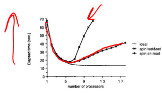

* Test-and-Set performs poorly once there is enough CPUs to cause contention for the lock
* Read before Test-and-Set performs better; performance is less than expected; there is still significant contention when CPUs notice release and all attempt acquisition
* Critical section performance degenerates
    * critical section requires bus traffic to modify shared structures
    * lock holder competes with CPU that's waiting as they test-and-set so the lock holder is slower
    * slower lock holder results in more contention

### Spinning Locks vs. Blocking Locks

Uniprocessor: Spinning vs Blocking

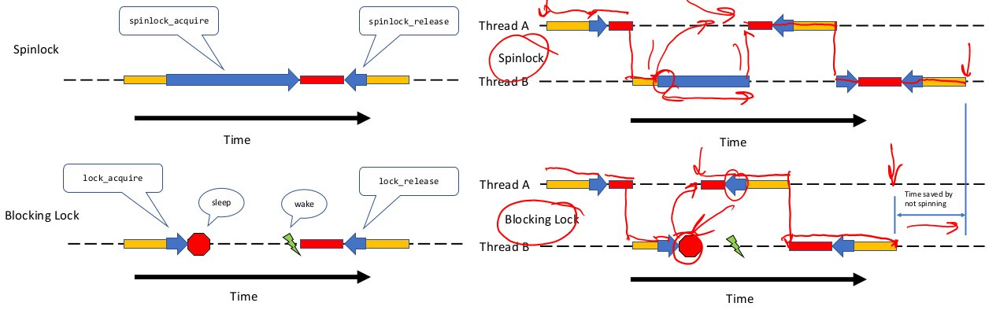

Spinning (busy-waiting) on a lock makes no sense on a uniprocessor. There was no other running process to release the lock. Blocking and (eventually) switching to the other lock holder is the only sensible option.

On SMP systems, the decision to spin or block is not as clear. The lock is held by another running CPU and will be freed without necessarily switching away from the requester

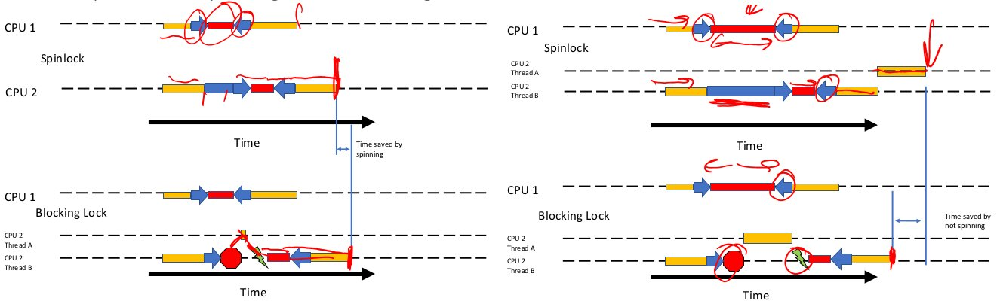

Blocking and switching to another process takes time; we need to save context and restore another. The cache contains the current process not the new process and adjusting the cache working set also takes time. The same applies to TLB. Switching back when the lock is free encounters the same issue.

Spinning wastes CPU time directly.

If the lock is held for less time than the overhead of switching to and back, it is more effective to spin. Spin locks expect critical sections to be short; no waiting for I/O within a spinlock, no nesting locks within a spinlock

When the spinlock holder is pre-empted at the end of the holder's time slice, mutual exclusion is still guaranteed. Other CPUs will spin until the holder is scheduled again.

Spinlock implementations generally disable interrupts in addition to acquiring locks to avoid lock-holder pre-emption
