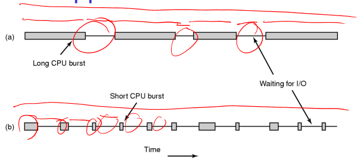
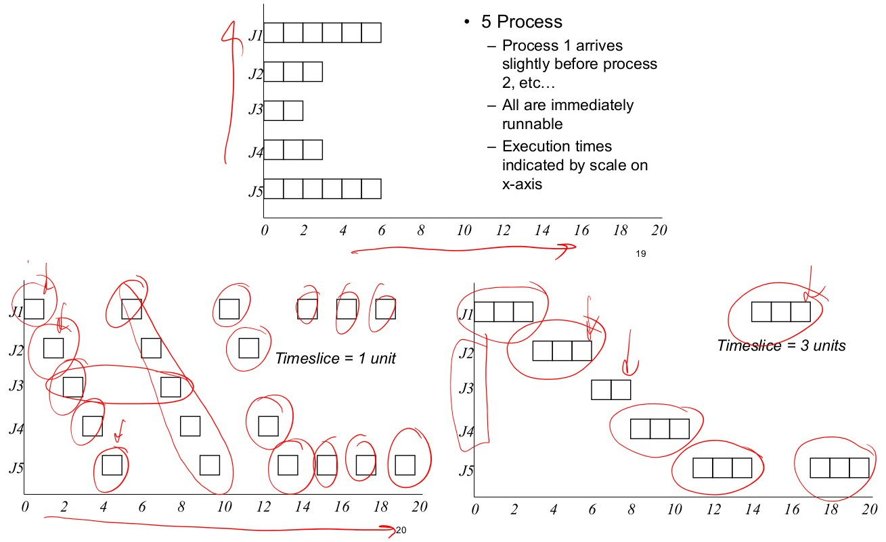
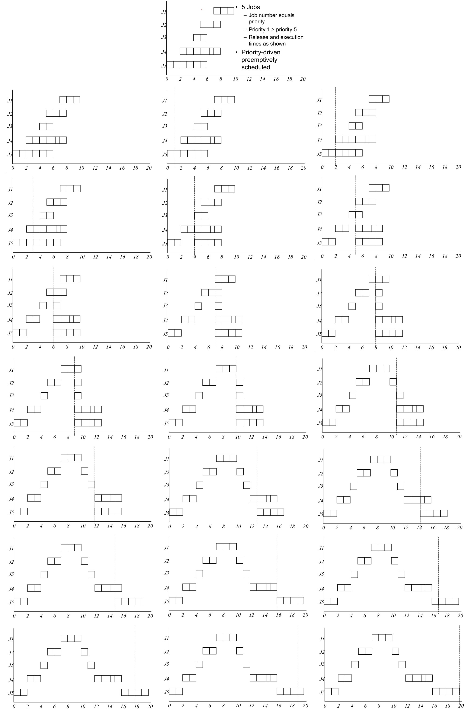
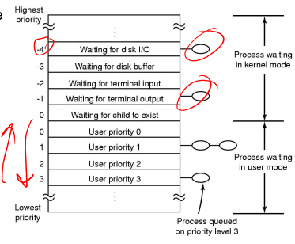
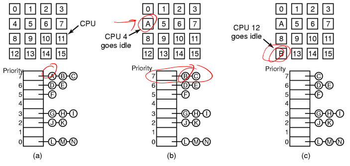

# Scheduling

On a multi-programmed system, we may have more than one _ready_ process  
On a batch system, we may have my jobs waiting to be run  
On a multi-user system, we may have many users concurrently using the system

The **scheduler** decides who to run next. The process of choosing is called **scheduling**.

Scheduling is not important in certain scenarios:

* if you have no choice - early systems usually use batching, where the scheduling algorithm is simple; run next on tape, or next on punch tape
* only one thing to run - simple PCs only ran a word processor etc., simple embedded systems (e.g. TV remote control, washing machine, etc.)

It is important in most realistic scenarios:

* multi-tasking/multi-user system -  e.g. an email daemon takes 2 seconds to process an email and the user clicks a button on the application
    * scenario 1: run daemon, then application -appears sluggish to user
    * scenario 2: run application, then daemon - application appears really responsive, small email delay is unnoticed

Scheduling decisions can have a dramatic effect on perceived performance of the system. It can also affect the correctness of a system with deadlines.

## Application Behaviour

Applications tend to have bursts of CPU usage alternating with periods of I/O wait. A process can be a 

* CPU-bound process - spends most of its time computing; time to completion is largely determined by received CPU time
* I/O-bound process - spends most of its time waiting for I/O to complete (small bursts of CPU to process I/O and request next I/O); time to completion is largely determined by I/O request time

We need a mix of CPU-bound and I/O-bound processes to keep both CPU and I/O systems busy. Processes can go from CPU-bound to I/O-bound (or vice-versa) in different phases of execution.

Choosing to run an I/O-bound process delays a CPU-bound process by very little.  
Choosing to run an CPU-bound process prior to a I/O-bound process delays the next I/O request significantly. There is no overlap of I/O waiting with computation resulting in the device (disk) being not as busy as possible.

Generally, **_favour I/O-bound processes over CPU-bound processes_**

## When is Scheduling Performed?

* a new process - run the parent or the child?
* a process exits - who runs next?
* a process waits for I/O - who runs next?
* a process blocks on a lock - who runs next? the lock holder?
* an I/O interrupt occurs - who do we resume, the interrupted process or the process that was waiting?
* on a timer interrupt?

Generally, a scheduling decision is required when a process (or thread) can no longer continue, or when an activity results in more than one ready process.

Recall: preemptive vs. non-preemptive scheduling

**Non-preemptive:** once a thread is in the _running_ state, it continues until it completes, blocks on I/O, or voluntarily yields the CPU. A single process can monopolise the entire system.  
**Preemptive:** the current thread can be interrupted by the OS and moved to _ready_ state. Usually after a timer interrupt and process has exceeded its maximum run time. It can also be a result of higher priority process that has become ready (after I/O interrupt). This ensures fairer service as a single thread can't monopolise the system

## Scheduling Algorithms

The choice of scheduling algorithm depends on the goal of the application (or the operating system). No one algorithm suits all environments.

We can roughly categorise scheduling algorithms as follows:

* **batch systems** - no users directly waiting, can optimise overall machine performance
* **interactive systems** - users directly waiting for their results, can optimise for users perceived performance
* **realtime systems** -  jobs have deadlines, must schedule such that all jobs (predictably) meet their deadlines

All algorithms have the following goals:

* **fairness** - give each process a _fair_ share of the CPU
* **policy enforcement** - what ever policy is chosen, the scheduler should ensure it is carried out
* **balance/efficiency** - try to keep all parts of the system busy

Interactive algorithms have additional goals:

* **minimise _response_ time** - response time is the time difference between issuing a command and getting the result; e.g. selecting a menu, and getting the result of that selection; response time is important to the user's perception of the performance of the system
* **provide _proportionality_** - proportionality is the user expectation that **_short jobs will have a short response time, and long jobs can have a long response time_**; generally, favour short jobs

Realtime algorithms has additional goals:

* **must meet _deadlines_** - each job/task has a deadline; a missed deadline can result in data loss or catastrophic failure (e.g. an aircraft control system missed deadline to apply breaks)
* **provide _predictablity_** - for some apps, an occasional missed deadline is okay (e.g. DVD decoder - predictable behaviour allows smooth DVD decoding with only rare skips)

### Interactive Scheduling

#### Round Robin Scheduling

Each process is given a **timeslice** to run in. When the time slice expires, the next process pre-empts the current process, and runs for its time slice, and so on. The pre-empted process is placed at the end of the queue. 

It can be implemented with a ready queue and a regular timer interrupt

**Pros**:

* fair
* easy to implement

**Cons**:

* assumes everybody is equal

**Issue**: what should the time slice be?  
If it is too short, we waste a lot of time switching between processes; e.g. timeslice of 4ms with 1ms context switch = 20% round robin overhead  
If it is too long, the system is not responsive; e.g. timeslice of 100ms, if 10 people hit the `enter` key simultaneously, the last guy to run will only see progress after 1 second. This degenerates into a first-come, first-serve if the time slice is longer than the burst length

##### Priorities

Each process (or thread) is associated with priority. This provides the basic mechanism to influence a scheduler decision; the scheduler will always choose a process/thread of higher priority over lower priority.

Priorities can be defined internally or externally;  
**internal**: e.g. I/O-bound or CPU-bound  
**external**: e.g. based on importance to user

Example:

Usually priorities are implemented by multiple priority queues, with a round robin on each queue. This does have the disadvantage that lower priorities can starve. They need to adapt priorities periodically (based on ageing or execution history)

## Traditional UNIX Scheduler

In the **traditional UNIX scheduler**, is a two-level scheduler. The high-level scheduler schedules processes between memory and disk. The low-level scheduler is the CPU scheduler, which is based on a multi-level queue structure with a round robin at each level

the highest priority (lower number) is scheduled.  
Priorities are **_re-calculated_** once per second, and re-inserted into appropriate ques. This avoids starvation of low priority threads and penalises CPU-bound threads

`priority = CPU_usage + nice + base`

* `CPU_usage` is the number of clock ticks; this decays over time to avoid permanently penalising the process
* `nice` is a value given the to process by a user to permanently boost or reduce its priority
* `base` is a set of hard-wired, negative values to boost priority of I/O-bound system activities; e.g. swapper, disk I/O, character I/O

## Multiprocessor Scheduling

Given X processes (or threads) and Y CPUs, we need a way to allocated the processes to CPUs.

### Single Shared Ready Queue

One approach is to have a **single shared ready queue**. When a CPU goes idle, it takes the highest priority process from the shared ready queue. Note that we need to synchronise the data structure that is keeping our prioritised round robin queue as it CPU will need to "compete" to get the next task.

**Pros**:

* simple
* automatic load balancing

**Cons**:

* lock contention on the ready queue can be a major bottleneck (due to frequent scheduling or many CPUs or both)
* not all CPUs are equal - the last CPU a process ran on is likely to have more related entries in the cache

### Affinity Scheduling

The basic idea of **affinity scheduling** is to try to run a process on the CPU it ran on last time.

An approach to this is **multiple queue multiprocessor scheduling**

Each CPU has its own ready queue.  
The coarse-grained algorithm assigns processes to CPUs  It defines the affinity, and roughly balances the load.  
The bottom-level fine-grained algorithm scheduler is the frequently invoked scheduler (e.g. on blocking on I/O, a lock, or exhausting timeslice). It runs on each CPU and selects from its own ready queue (ensures affinity). If nothing is available from the local ready queue, it runs a process from another CPUs ready queue rather than go idle (aka "work stealing")

**Pros**:

* no lock contention on per-CPU ready queues in the (hopefully) common case
* load balancing to avoid idle queue
* automatic affinity to a single CPU for more cache friendly behaviour
